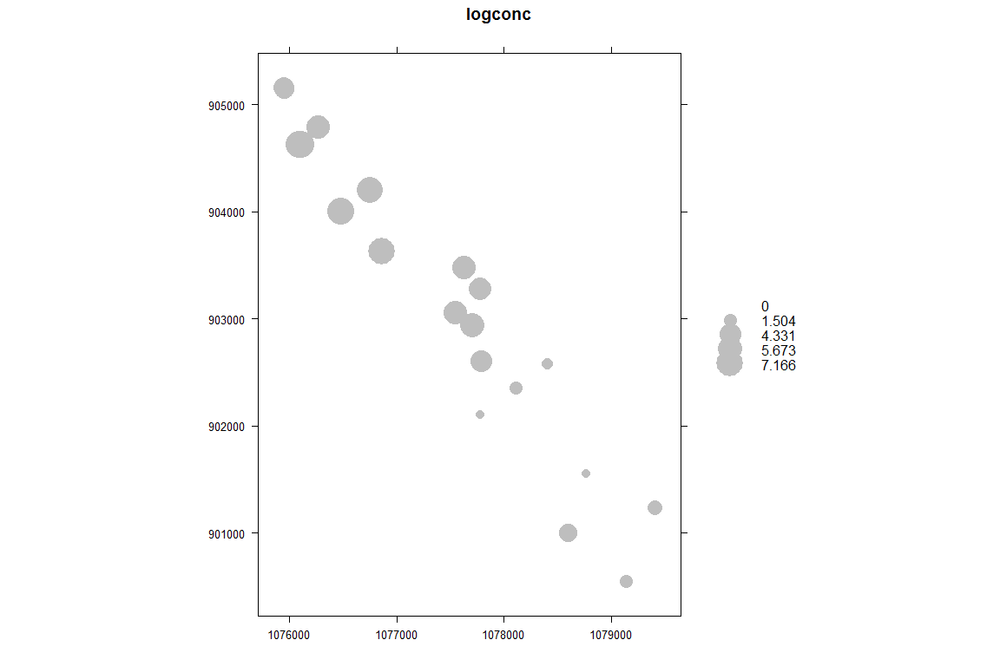
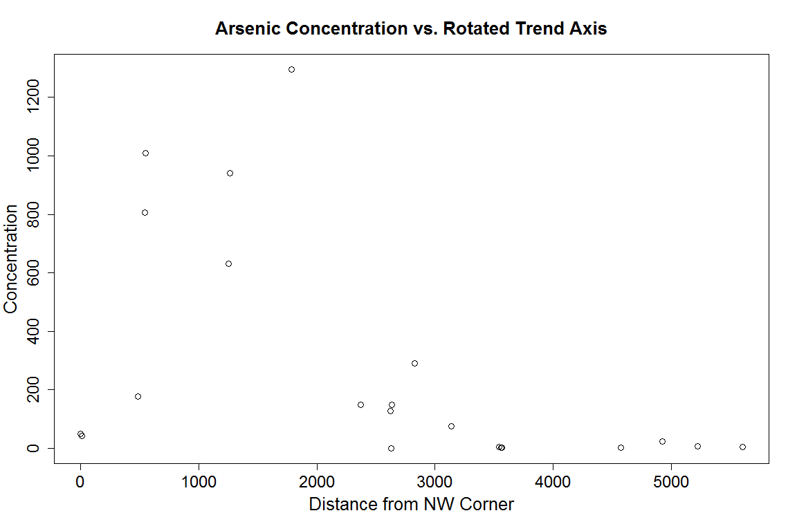

# Geostatical Analysis Notes
Jackson Cothren  
March 17, 2015  

# Structure of geostastical data (field data)

We separate the structure of a field dataset into large-scale structure (trends) and small-scale strcuture (residual variation, similar to spatial autocorrelation).

Load our necessary packages...


```r
# load necessary packages:
library(maptools)
```

```
## Loading required package: sp
## Checking rgeos availability: TRUE
```

```r
library(gstat)
library(rgdal)
```

```
## rgdal: version: 0.9-1, (SVN revision 518)
## Geospatial Data Abstraction Library extensions to R successfully loaded
## Loaded GDAL runtime: GDAL 1.11.1, released 2014/09/24
## Path to GDAL shared files: C:/Users/jcothren/Documents/R/win-library/3.1/rgdal/gdal
## GDAL does not use iconv for recoding strings.
## Loaded PROJ.4 runtime: Rel. 4.8.0, 6 March 2012, [PJ_VERSION: 480]
## Path to PROJ.4 shared files: C:/Users/jcothren/Documents/R/win-library/3.1/rgdal/proj
```

```r
library(lattice)
library(geoR)
```

```
## Loading required package: MASS
## --------------------------------------------------------------
##  Analysis of geostatistical data
##  For an Introduction to geoR go to http://www.leg.ufpr.br/geoR
##  geoR version 1.7-4.1 (built on 2012-06-29) is now loaded
## --------------------------------------------------------------
```

```r
library(spatstat)
```

```
## 
## spatstat 1.40-0       (nickname: 'Do The Maths') 
## For an introduction to spatstat, type 'beginner'
## 
## Note: spatstat version 1.40-0 is out of date by more than 3 months; we recommend upgrading to the latest version.
## 
## Attaching package: 'spatstat'
## 
## The following object is masked _by_ '.GlobalEnv':
## 
##     rose
## 
## The following object is masked from 'package:MASS':
## 
##     area
## 
## The following object is masked from 'package:lattice':
## 
##     panel.histogram
## 
## The following object is masked from 'package:gstat':
## 
##     idw
```


## Exploring large scale structure 

Before studying models for variograms (which describe small-scale or residual variation), we should discuss the removal of any large-scale variation (or trend) that might be present. In spatial modeling, researchers have historically taken two different views on describing any trend present. Both of these views recognize the same basic model form for the process. Before discussing the two approaches taken toward modeling any trend present, it is important to understand the following model form used in virtually any type of nondeterministic model.

Model Form: Recall that the set of random variables ${Z(s):s\in R}$ is a random function,
with some mean and variance given by $\mu(s)$ and $\sigma^2(s)$ respectively. Under weak stationarity, the mean and variance are no longer functions of the location $s$. However, more generally (and realistically), nondeterministic models are assumed to have the form:

$$
\begin{align}
  Z(s) &= \mu(s) + \epsilon(s),s \in R \\
       & =(\mbox{Large-scale varation}) + (\mbox{Small-scale variation})
\end{align}
$$ 

where $R$ is the region of interest.

The mean (or trend) function $\mu(s)$ may be a function of the location and/or of some list
of covariates. It may be expressed as a linear or nonlinear function of some regression parameters, a generalized linear model (GLM), a generalized additive model (GAM), or most generally may be modeled nonparametrically. One of the goals of this opening section is to introduce a nonparametric method of modeling the trend known as median polish. 

As mentioned at the outset, there are two general approaches taken toward modeling the trend and error structure in spatial processes. These are:

1. First remove the trend and perform any subsequent analysis on the resulting residuals.
2. Model the trend and error structure simultaneously. (One example of this approach is
universal kriging, discussed later)

In this section, we'll take the first approach, and look at both parametric and nonparametric
methods of trend removal.

### Parametric fitting

Consider the following data on arsenic concentrations taken over 21 locations with corresponding elevations. 

* $z$ = the arsenic concentration measurements (in ppb),
* $w$ = the corresponding elevations (in feet),
* $x$ = $s_1$ = the x-coordinate of the measurement, and
* $y$ = $s_2$ = the y-coordinate of the measurement.


```r
arsenic <- read.table('arsenic.txt')
arsenic
```

```
##             x      y elev   conc
## 923   1079142 900549 3181    4.5
## 922   1079408 901237 3165    7.0
## 920   1078595 901003 3223   24.0
## 921   1078769 901551 3217    2.0
## 917   1078114 902353 3195    4.5
## 908   1077706 902940 3219  291.0
## 909A  1077782 903279 3210  128.0
## 909B  1077787 903276 3242    1.0
## M-17  1077786 902610 3272   76.0
## 907   1077783 902100 3240    2.0
## HLA-1 1077549 903063 3235  149.0
## HLA-2 1077625 903481 3204  149.0
## 107   1076756 904201 3206  631.0
## 905   1076269 904793 3245  178.0
## 103A  1075951 905146 3218   43.0
## 103B  1075951 905157 3232   50.0
## 100   1076865 903624 3231 1295.0
## 101B  1076479 904007 3244  941.0
## 102A  1076092 904632 3223  805.0
## 102B  1076105 904632 3236 1010.0
## 915   1078406 902581 3235    3.3
```

Note the histograms of both arsenic concentration and it's natural log. The natural log tends to spread our data better (rather than having so many values concentrated a smaller values) so we will often fit data to the natural log of the concentrations.


```r
arsenic$logconc <- log(arsenic$conc)
```


```r
par(mfrow = c(1,2))
hist(arsenic$conc, main='Arsenic conc in ppb');
hist(arsenic$logconc, main='log(Arsenic conc in ppb)');
```

 

```r
par(mfrow = c(1,1))
```


1. If there were a roughly linear trend in the x-direction, and a linear relationship between arsenic levels and elevations, we might try modeling the mean function as the regression model...

$$\mu(s) = \beta_o + \beta_1 x + \beta_3 w$$

2. Suppose there were linear trends in both the x- and y-directions which were interactive, and an exponentially decreasing relationship between arsenic levels and elevation. What mean model could we try fitting to these data?

$$\mu(s) = \beta_o + \beta_1 x + \beta_2 y + \beta_3 x y + + \beta_4 e^{-w}$$

3. Suppose a bubble plot reveals a definite SE-NW trend in the arsenic concentrations.


```r
# coerce data.frame to SpatialPointsDataFrame
coordinates(arsenic) <- ~x+y
bubble(arsenic, 'logconc', scales=list(draw=T), maxsize=4.0, col='grey')
```

 

What trend function could we construct? You could try 

$$\mu(s) = \beta_o + \beta_1 x + \beta_2 y$$

In R we simply use the now familiar `lm` command.


```r
arsenic.reg <- lm(log(conc)~x+y, data=arsenic)
summary(arsenic.reg)
```

```
## 
## Call:
## lm(formula = log(conc) ~ x + y, data = arsenic)
## 
## Residuals:
##    Min     1Q Median     3Q    Max 
## -3.209 -1.324  0.614  1.267  2.202 
## 
## Coefficients:
##               Estimate Std. Error t value Pr(>|t|)
## (Intercept)  2.710e+03  2.317e+03   1.170    0.257
## x           -2.092e-03  1.311e-03  -1.596    0.128
## y           -5.004e-04  1.028e-03  -0.487    0.632
## 
## Residual standard error: 1.808 on 18 degrees of freedom
## Multiple R-squared:  0.4651,	Adjusted R-squared:  0.4057 
## F-statistic: 7.826 on 2 and 18 DF,  p-value: 0.003584
```

Neither $x$ nor $y$ alone predict arsenic concentrations very well at all. The residuals are very large compared to the data values themselves.

4. Since trend is neither in the EW or NS direction, but rather in a diagnal direction running SE-NW, we might be better off creating a new explanatory variable along this direction. For example, since the upper left-hand corner of the region is sampled at the coordinates (1075951, 905157) we could create a variable which is the distance from this point. 


```r
x <- arsenic$x
y <- arsenic$y
arsenic$dist <- sqrt((x-min(x))**2 + (y-max(y))**2) + 1  # add 1 so there is no zero

plot(arsenic$dist,arsenic$conc,ylab="Concentration",xlab="Distance from NW Corner", main="Arsenic Concentration vs. Rotated Trend Axis",cex.main=1.6, cex.lab=1.6,cex.axis=1.5,cex=1.3, mgp=c(2.7,1,0))
```

 

This essentially creates a new x-axis in the predominate direction of the samples. There are other (perhaps better) ways to do this but lets see what happens when we fit the following model


```r
arsenic.rot <- lm(log(conc)~dist, data=arsenic)
summary(arsenic.rot)
```

```
## 
## Call:
## lm(formula = log(conc) ~ dist, data = arsenic)
## 
## Residuals:
##     Min      1Q  Median      3Q     Max 
## -3.8400 -1.5261  0.9335  1.2311  2.5777 
## 
## Coefficients:
##               Estimate Std. Error t value Pr(>|t|)    
## (Intercept)  6.1728972  0.7231797   8.536 6.32e-08 ***
## dist        -0.0008872  0.0002384  -3.722  0.00145 ** 
## ---
## Signif. codes:  0 '***' 0.001 '**' 0.01 '*' 0.05 '.' 0.1 ' ' 1
## 
## Residual standard error: 1.83 on 19 degrees of freedom
## Multiple R-squared:  0.4217,	Adjusted R-squared:  0.3912 
## F-statistic: 13.85 on 1 and 19 DF,  p-value: 0.001445
```

Now we see a definite relationship between the distance from the NW corner (along the "rotated" x-axis) and arsenic concentrations.

However, in looking at the plot above, a linear relationship between distance and concentration is not apparent. Instead it appears to be decreasing exponentially. A better model might therefore be...

$$\mu(s) = d^{\alpha-1}e^{\frac{-d}{\beta}}$$

Unfortunately, this is a nonlinear relationship and we must use nonlinear least squares or the `nls` command. Nonlinear least squares linearizes the model using a Taylor series centered on a starting point for $\alpha$ and $\beta$. 


```r
conc <- arsenic$conc
dist <- arsenic$dist
arsenic.nlfit <- nls(log(conc) ~ (dist**(alpha-1))*exp(-dist/beta), start=list(alpha=2.17, beta=855))
summary(arsenic.nlfit)
```

```
## 
## Formula: log(conc) ~ (dist^(alpha - 1)) * exp(-dist/beta)
## 
## Parameters:
##        Estimate Std. Error t value Pr(>|t|)    
## alpha 1.350e+00  2.453e-02  55.054  < 2e-16 ***
## beta  1.904e+03  3.285e+02   5.794 1.39e-05 ***
## ---
## Signif. codes:  0 '***' 0.001 '**' 0.01 '*' 0.05 '.' 0.1 ' ' 1
## 
## Residual standard error: 1.655 on 19 degrees of freedom
## 
## Number of iterations to convergence: 9 
## Achieved convergence tolerance: 6.265e-06
```

We get a smaller residual standard error and both $\alpha$ and $\beta$ are highly significant. Let's use the `nls` model to fit a curve to the sample locations.


```r
val <- seq(0,5000,5)
concdens <- (val**(summary(arsenic.nlfit)$coef[1,1]-1))*exp(-val/summary(arsenic.nlfit)$coef[2,1])
plot(arsenic$dist,log(arsenic$conc),ylab="ln(conc)",xlab="Distance from NW Corner", main="Arsenic Concentration vs. Rotated Trend Axis",cex.main=1.6, cex.lab=1.6,cex.axis=1.5,cex=1.3, mgp=c(2.7,1,0))
lines(val,concdens, col='darkred')
```

 

So this particular concentration vs. distance model does seem to fit the actual trend a little better. 

All of what we have done so far with the arsenic dataset are examples of fitting __parametric__ models to the mean function in an effort to detrend the data _before_ attempting any analysis of the spatial correlation structure. This is very similar, indeed the same, as what we did for both point pattern and lattice data types.

If fitting a parametric model proves difficult, an alternative __non-parametric__ approach can be attempted. One common and very useful method is due to the famous Tukey, called the __median polish__. 

### Median polishing

The algorith to _polish_ $Z$ is as follows...

1. Assume data on a $p × q$ rectangular grid ${(x_l, y_k):k=1,...,p; l = 1,...,q}$. You can regard grid nodes as cells in a 2-way table. If the data isn't on a rectangular grid, it is common to create a grid and assign data values to the nearest grid point leaving the other grid locations empty.
2. Operate iteratively on the data. Alternately subtracting row means (or medians) and column means (or medians) and accumulate these means or medians in an extra column and row of cells.
3. Repeat this procedure until another iteration produces virtually no change.
4. Final entries in the extra cells are the mean or median polish estimates or row effects $r_1,..,r_p$, column effects $c_1,...,c_q$ and an overall effect $a$.
5. Final entries in the body of table are residuals, $\hat{epsilon}_{kl}$, such that 
$$
\begin{align}
Z(x_l, y_k) &= \hat{a}+\hat{r}_k+\hat{c}_l+\hat{\epsilon}_{kl} \\
&= \mu(x_l, y_k) + \hat{\epsilon}_{kl} \\
&= \mu(s) + \epsilon(s) \\
\end{align}
$$

First let's look at an example for non-spatial data - deaths from sport parachuting (from ABC of EDA, p.224):


```r
deaths <- rbind(c(14,15,14), c( 7, 4, 7), c( 8, 2,10), c(15, 9,10), c( 0, 2, 0))
deaths
```

```
##      [,1] [,2] [,3]
## [1,]   14   15   14
## [2,]    7    4    7
## [3,]    8    2   10
## [4,]   15    9   10
## [5,]    0    2    0
```

```r
dimnames(deaths) <- list(c("1-24", "25-74", "75-199", "200++", "NA"),paste(1973:1975))
med.d <- medpolish(deaths)
```

```
## 1: 19
## Final: 19
```

```r
## Check decomposition:
all(deaths == med.d$overall + outer(med.d$row,med.d$col, "+") + med.d$resid)
```

```
## [1] TRUE
```

The `gstat` packages contains a dataset obtained from Gomez and Hazen (1970, Tables 19 and 20) on coal ash for the Robena Mine Property in Greene County Pennsylvania. The values represent percentages of coalash measured at 208 different sites. 


```r
data(coalash)
summary(coalash)
```

```
##        x                y            coalash      
##  Min.   : 1.000   Min.   : 1.00   Min.   : 7.000  
##  1st Qu.: 5.000   1st Qu.: 8.00   1st Qu.: 8.960  
##  Median : 7.000   Median :13.00   Median : 9.785  
##  Mean   : 7.534   Mean   :12.91   Mean   : 9.779  
##  3rd Qu.:10.000   3rd Qu.:18.00   3rd Qu.:10.568  
##  Max.   :16.000   Max.   :23.00   Max.   :17.610
```

```r
coordinates(coalash) <- ~x+y
bubble(coalash, 'coalash', scales=list(draw=T), maxsize=2.0)
```

 

Note that these data are already _gridded_.  You will notice unusually high values in some places, and there seems to be a trend of larger to smaller coalash percentages moving roughly from SW corner to the NE corner of the plot. Let's use bloxplots on the rows and columns to summarize this. The following commands create a 

1. boxplot of the coal ash values row by row (y-value), where the 50th value (an outlier) has been omitted from the plot and
2. boxplot of the coal ash values column by column (x-value), again omitting the outlier.


```r
# coerce the SpatialPointsDataFrame to a data.frame again
coalash <- as.data.frame(coalash)
par(mfrow = c(1,2))
bwplot(y~coalash,data=coalash,subset=-50, cex=1.3,xlab="Coal Ash %", ylab="y", main="Coal Ash % Row Summaries")
```

 

```r
bwplot(x~coalash,data=coalash,subset=-50, cex=1.3,xlab="Coal Ash %", ylab="x", main="Coal Ash % Column Summaries")
```

 

```r
par(mfrow = c(1,1))
```

To perform a true median polish and remove the underlying trend, take the following steps in R.


```r
# Creates a matrix of the raw coal ash percentages according to their locations..
coal.mat <- tapply(coalash$coalash, list(factor(coalash$x),factor(coalash$y)),function(x)x) 
coal.mat
```

```
##        1    2     3     4     5     6     7     8     9    10    11    12
## 1     NA   NA    NA    NA    NA    NA    NA    NA    NA    NA    NA    NA
## 2     NA   NA    NA    NA    NA    NA    NA 10.01    NA 11.15 11.31  9.92
## 3     NA   NA    NA 10.93  9.76 10.41 10.39  8.23 10.82  9.91  9.41 11.05
## 4  10.59 9.29  9.64 10.94 11.10 10.82 11.11 11.04 11.75 10.17  9.37 10.11
## 5  10.43 8.75  9.52  9.53 10.80 17.61 10.96 10.28  9.78 10.55 11.21 11.46
## 6   9.32 8.96 10.06 10.61  8.86 10.87 10.83 13.07 11.00 11.61  9.93 10.41
## 7     NA 8.27 12.65 10.27  9.48    NA 10.09 10.47  9.79  9.16 10.70  8.45
## 8     NA 8.14  9.63  9.59  9.22 13.06  8.69 11.58 10.19 10.04  9.27  8.90
## 9     NA   NA    NA  9.82  9.61 11.41 11.17  9.46  9.15 11.19  9.28  8.07
## 10    NA   NA    NA  7.81  8.20  9.96  9.39  8.54  8.15  8.10 10.13  7.96
## 11    NA   NA    NA    NA    NA  9.15  9.56 10.87  9.20 11.30  8.61  7.00
## 12    NA   NA    NA    NA    NA    NA    NA    NA    NA    NA  8.78  7.90
## 13    NA   NA    NA    NA    NA    NA    NA    NA    NA    NA    NA    NA
## 14    NA   NA    NA    NA    NA    NA    NA    NA    NA    NA    NA    NA
## 15    NA   NA    NA    NA    NA    NA    NA    NA    NA    NA    NA    NA
## 16    NA   NA    NA    NA    NA    NA    NA    NA    NA    NA    NA    NA
##       13    14    15    16    17    18    19    20    21    22    23
## 1     NA 10.21  9.92 11.17    NA    NA    NA    NA    NA    NA    NA
## 2     NA 10.73 10.82 10.14    NA    NA    NA    NA    NA    NA    NA
## 3  12.50  9.46 11.65  9.93  9.97    NA    NA    NA    NA    NA    NA
## 4   9.63  9.35  8.96 10.27  9.70 11.21 10.74  9.79    NA    NA    NA
## 5  10.82  9.78  9.88 10.21  9.84  9.89 12.80  9.06 10.39    NA    NA
## 6  10.12 10.38  8.90 11.09 10.29 10.34 10.03 10.70 10.65    NA    NA
## 7   9.40  9.79 10.18 10.63  9.84  8.20  9.36 11.21 10.36 11.62    NA
## 8   9.48  8.91  9.34  8.82 10.01  9.82  8.57  8.98  9.58 10.91    NA
## 9  10.99  9.22 10.56 10.18  9.01 10.06  9.01  9.27 10.66  8.76    NA
## 10  9.92 11.43  9.06  9.34  7.68  8.58  9.04  8.19  8.92  8.89  8.59
## 11  7.85    NA    NA  8.61  9.25  8.89  7.28  7.88  7.80  9.10  9.00
## 12  8.21    NA    NA    NA  7.83  8.64  9.58  7.61  7.84  7.62 11.86
## 13    NA    NA    NA    NA  9.14  7.04  9.69  8.20  9.03  9.65  8.91
## 14    NA    NA    NA    NA    NA  8.81  9.96  8.77  8.60    NA  9.99
## 15    NA    NA    NA    NA  7.63  7.95  9.91    NA    NA    NA    NA
## 16    NA    NA    NA    NA  9.07    NA    NA    NA    NA    NA    NA
```

```r
# so that the median polish can be applied on the resulting table (as above)
coal.mp <- medpolish(coal.mat, na.rm=T)
```

```
## 1: 136.635
## 2: 133.3425
## Final: 132.8938
```

```r
coal.mp
```

```
## 
## Median Polish Results (Dataset: "coal.mat")
## 
## Overall: 9.66125
## 
## Row Effects:
##         1         2         3         4         5         6         7 
##  0.925000  1.166250  0.326250  0.673750  0.548750  0.758750  0.456250 
##         8         9        10        11        12        13        14 
## -0.141250  0.141250 -1.000000 -0.790000 -1.252187 -0.753750 -0.358750 
##        15        16 
## -1.641250 -0.341250 
## 
## Column Effects:
##          1          2          3          4          5          6 
##  0.2200000 -1.4600000 -0.3600000  0.1112500 -0.2637500  0.8918750 
##          7          8          9         10         11         12 
##  0.6887500  0.2112500  0.3287500  0.3312500 -0.2500000 -0.6200000 
##         13         14         15         16         17         18 
## -0.1195313 -0.4031250 -0.0937500  0.0000000 -0.2775000 -0.0750000 
##         19         20         21         22         23 
##  0.3918750 -0.5400000  0.1512500  0.2287500  0.1287500 
## 
## Residuals:
##         1       2       3        4        5        6        7        8
## 1      NA      NA      NA       NA       NA       NA       NA       NA
## 2      NA      NA      NA       NA       NA       NA       NA -1.02875
## 3      NA      NA      NA  0.83125  0.03625 -0.46937 -0.28625 -1.96875
## 4   0.035  0.4150 -0.3350  0.49375  1.02875 -0.40688  0.08625  0.49375
## 5   0.000  0.0000 -0.3300 -0.79125  0.85375  6.50812  0.06125 -0.14125
## 6  -1.320  0.0000  0.0000  0.07875 -1.29625 -0.44188 -0.27875  2.43875
## 7      NA -0.3875  2.8925  0.04125 -0.37375       NA -0.71625  0.14125
## 8      NA  0.0800  0.4700 -0.04125 -0.03625  2.64812 -1.51875  1.84875
## 9      NA      NA      NA -0.09375  0.07125  0.71562  0.67875 -0.55375
## 10     NA      NA      NA -0.96250 -0.19750  0.40688  0.04000 -0.33250
## 11     NA      NA      NA       NA       NA -0.61312  0.00000  1.78750
## 12     NA      NA      NA       NA       NA       NA       NA       NA
## 13     NA      NA      NA       NA       NA       NA       NA       NA
## 14     NA      NA      NA       NA       NA       NA       NA       NA
## 15     NA      NA      NA       NA       NA       NA       NA       NA
## 16     NA      NA      NA       NA       NA       NA       NA       NA
##           9       10       11       12        13        14       15
## 1        NA       NA       NA       NA        NA  0.026875 -0.57250
## 2        NA -0.00875  0.73250 -0.28750        NA  0.305625  0.08625
## 3   0.50375 -0.40875 -0.32750  1.68250  2.632031 -0.124375  1.75625
## 4   1.08625 -0.49625 -0.71500  0.39500 -0.585469 -0.581875 -1.28125
## 5  -0.75875  0.00875  1.25000  1.87000  0.729531 -0.026875 -0.23625
## 6   0.25125  0.85875 -0.24000  0.61000 -0.180469  0.363125 -1.42625
## 7  -0.65625 -1.28875  0.83250 -1.04750 -0.597969  0.075625  0.15625
## 8   0.34125  0.18875  0.00000  0.00000  0.079531 -0.206875 -0.08625
## 9  -0.98125  1.05625 -0.27250 -1.11250  1.307031 -0.179375  0.85125
## 10 -0.84000 -0.89250  1.71875 -0.08125  1.378281  3.171875  0.49250
## 11  0.00000  2.09750 -0.01125 -1.25125 -0.901719        NA       NA
## 12       NA       NA  0.62094  0.11094 -0.079531        NA       NA
## 13       NA       NA       NA       NA        NA        NA       NA
## 14       NA       NA       NA       NA        NA        NA       NA
## 15       NA       NA       NA       NA        NA        NA       NA
## 16       NA       NA       NA       NA        NA        NA       NA
##          16       17       18        19       20       21          22
## 1   0.58375       NA       NA        NA       NA       NA          NA
## 2  -0.68750       NA       NA        NA       NA       NA          NA
## 3  -0.05750  0.26000       NA        NA       NA       NA          NA
## 4  -0.06500 -0.35750  0.95000  0.013125 -0.00500       NA          NA
## 5   0.00000 -0.09250 -0.24500  2.198125 -0.61000  0.02875          NA
## 6   0.67000  0.14750 -0.00500 -0.781875  0.82000  0.07875          NA
## 7   0.51250  0.00000 -1.84250 -1.149375  1.63250  0.09125  1.2737e+00
## 8  -0.70000  0.76750  0.37500 -1.341875  0.00000 -0.09125  1.1612e+00
## 9   0.37750 -0.51500  0.33250 -1.184375  0.00750  0.70625 -1.2713e+00
## 10  0.67875 -0.70375 -0.00625 -0.013125  0.06875  0.10750  0.0000e+00
## 11 -0.26125  0.65625  0.09375 -1.983125 -0.45125 -1.22250 -2.2204e-16
## 12       NA -0.30156  0.30594  0.779062 -0.25906 -0.72031 -1.0178e+00
## 13       NA  0.51000 -1.79250  0.390625 -0.16750 -0.02875  5.1375e-01
## 14       NA       NA -0.41750  0.265625  0.00750 -0.85375          NA
## 15       NA -0.11250  0.00500  1.498125       NA       NA          NA
## 16       NA  0.02750       NA        NA       NA       NA          NA
##          23
## 1        NA
## 2        NA
## 3        NA
## 4        NA
## 5        NA
## 6        NA
## 7        NA
## 8        NA
## 9        NA
## 10 -0.20000
## 11  0.00000
## 12  3.32219
## 13 -0.12625
## 14  0.55875
## 15       NA
## 16       NA
```

The `medpolish` function returns the grand median, vectors of row and column effects, and the resulting residuals under the names: `grand`, `col`, `row`, and `residuals`. To extract the trend or large-scale variation, we could do this...


```r
coal.trend <- coal.mat - coal.mp$residuals
```

We can assess whether or not the median polish successfully removed any trend by comparing greyscale plots of the regions before and after the polish. 


```r
par(mfrow=c(1,3))

# Computes the minimum and maximum of all coal ash percentages and trend values, not including missing values (!is.na).
zmin <- min(coal.mat[!is.na(coal.mat)], coal.trend[!is.na(coal.trend)]) 
zmax <- max(coal.mat[!is.na(coal.mat)], coal.trend[!is.na(coal.trend)]) 

# Creates a greyscale map of the coal ash %’s without interpolation.
image(x=1:max(coalash$x),y=1:max(coalash$y), coal.mat,zlim=c(zmin,zmax),cex.axis=1.5, xlab="Columns",ylab="Rows",cex.lab=1.6,col=gray.colors(12))
# Puts legend on the plot with colors matching those in image statement.
# image.legend(9.5,3,zlim=range(coal.mat, na.rm=T),col=gray.colors(12)) 
title("Original Coal Ash %’s",cex.main=1.5)

# Creates a greyscale map of the coal ash trend values w/o interpolation.
image(x=1:max(coalash$x),y=1:max(coalash$y), 
coal.trend,zlim=c(zmin,zmax),cex.axis=1.5, xlab="Columns",ylab="Rows",cex.lab=1.6,col=gray.colors(12))
# Puts legend on the plot with colors matching those in image statement.
# image.legend(9.5,3,zlim=range(coal.trend, na.rm=T),col=gray.colors(12))
title("Median Polish Trend",cex.main=1.5)

# Creates a greyscale map of the coal ash residuals w/o interpolation.
image(x=1:max(coalash$x),y=1:max(coalash$y), 
coal.mp$resid,zlim=range(coal.mp$resid, na.rm=T),xlab="Columns",ylab="Rows",cex.lab=1.6,cex.axis=1.5,col=gray.colors(12))
# image.legend(9.5,3,zlim=range(coal.mp$resid, na.rm=T),col=gray.colors(12))
title("Median Polish Residuals",cex.main=1.5)
```

 

```r
par(mfrow=c(1,1))
```

One could also look at moving window statistics to see if the mean and variance of the
median polish residuals are stable.


```r
mean(!is.na(coal.mp$residuals))
```

```
## [1] 0.5652174
```

```r
var(as.vector(!is.na(coal.mp$residuals)))
```

```
## [1] 0.2464163
```


Some final comments on median polish

1. The technique of median polish is generally used prior to computing the variogram to remove any spatial trend present which is not well-described by some parsimonious function. After this large-scale variation is removed, all subsequent spatial analysis takes place on the median polish residuals. As estimation of the variogram presumes a stationary mean and variance, it is generally reasonable to assume that the residuals resulting from a median polish satisfy this property.

2. The median polish algorithm is not affected by missing data or irregular grids.

3. There are numerous other types of polishing that could be done. Instead of medians, one might choose to polish with means (if there are no gross outliers), trimmed means, or any type of weighted average of the data values. The basic decomposition of the trend into grand, row, and column effects will remain the same, and the algorithm will preserve this relationship throughout. Using medians is the most common choice due to their general robustness to erratic data values.

4. The median polish is not guaranteed to converge, but does in certain cases (see Fink, A.M. How to Polish off Median Polish. SIAM Journal of Scientific and Statistical Computing, 9, 932-940 (1988), for details). For this reason, a stopping rule is often defined for the algorithm of the form: Whenever none of the entries in the table change by more than o at a given iteration, the algorithm is terminated.

5. Removal of the trend prior to modeling the covariance structure receives mixed reviews from users of spatial techniques. Some feel that removing the trend (i.e. modeling the large-scale variation) introduces bias into the resulting residuals from which the covariance structure is extracted. This bias is a result of the choice of the trend function or method used. However, failure to remove any underlying trends negates the validity of the variogram due to the stationarity assumption. So, in either case, there is a problem. One final alternative is to model the trend and the covariance structure simultaneously, as is done with universal kriging. The difficulty here is that it is often very hard to separate which effects are due to large-scale and small-scale variation. 

## Exploring small-scale structure (the variogram)

There are several methods to explore the small-scale dependence. The h-scatterplot can be used to examine the strength of association between observations of the response variable as a function of distance and direction. The covariance function, correlogram, and variogram (or semivariogram) are all functions that numerically characterize the strength of such associations. Before we look at how to work with these, we understand taht With most spatial data, two common assumptions are made. 

1. __Spatial Continuity__: The spatial autocorrelation between the responses at 2 sites only depends on the distance and perhaps direction of orientation, not on where these sites are located in the region of interest.
2. __Stationarity__: Additionally, it is often assumed that the mean and variance are constant across the region of interest (p. 162 (B&G)). 

We'll explore both of these laters. In both time series analysis and spatial analysis, it is necessary to make some kind of assumption such as these in order to estimate the correlation pattern and the variance because realizations of the data cannot be assumed independent. Both of these two assumptions essentially allow for global homogeneity, so that different parts of the region can be treated as if they were replicates. This enables computation of a common covariance function for all parts of the region of interest. Removing the trend (or the dependence of a response variable on spatial location) is how we often meet the criteria imposed by these assumptions. 

There are two basic types of stationarity assumptions, outlined below. The first is known as _covariance_, _second-order_, or _weak stationarity_, and the second is know as _intrinsic stationarity_.

1. _Covariance_, _Second-Order_ or _Weak Stationarity_: This is assumed for the covariance function (and corresponding correlation function or correlogram). 
* $E(Y_i) = E(Y_j)$ for all sites $i, j \in \mathbb{R}$. 
* $\mathbb{R}$ $Cov(Y_i , Y_j ) = C(h)$ where $h = (s1_i , s2_i) - (s1_j, s2_j )$. 
* The first condition implies that the mean is constant over the region while the second conditions implies that the variance is the same everywhere and the covariance between two response variables depends only on the distance and direction between the two sites, not the location.

2. _Intrinsic Stationarity_: This is assumed for the variogram (or semivariogram).
* $E(Y_i) = E(Y_j )$ for all sites $i, j \in \mathbb{R}$. 
* $Var(Y_i - Y_j ) = \gamma(h), h = (s1_i, s2_i) - (s1_j, s2+j )$. 
* This implies that the mean is constant over the region $\mathbb{R}$ and the variance of the _difference_ is the same everywhere. The variance of the $Y_i's$ may not be the same everywhere. This is the weaker of the two types of stationarity assumptions.

### h-scatterplots (lag scatterplots)
We observe the process $Z$ at equally spaced locations $s_1,...,s_n$. Plot $Z(s_i + h\mathbf{e})$ versus $Z(s_i)$ for a fixed vector $\mathbf{e}$ (defines direction) of unit length, a fixed scalar $h$, and for all $i = 1,...,n$ (e.g. $\mathbf{e} = (1, 0), h=1$). Outliers can be detected with the resulting graph.The graph may reveal the existence of anisotropy and/or nonstationarity in the mean and/or variance.


```r
# Plots the cross h-scatterplots for the Walker Lake (n=100) V&U-data, and
# plots the cross-covariogram, cross-correlogram, and cross-semivariogram
# functions for the U,V data.  The hscatter function was used to generate
# the cross h-scatterplots.
# ========================================================================
walk100 <- read.table("walk100.txt",header=T) # Reads in walk100 Walker Lake data.
x <- walk100$x                         # x is set to the x-values of "walk100".
y <- 11 - walk100$y                    # y is set to 11 - the y-values of "walk100".
v <- walk100$v                         # v is set to the V-values of "walk100".
u <- walk100$u                         # u is set to the U-values of "walk100".

# Creates the 5 cross-h scatterplots on page 39 of the class notes
# ================================================================
par(mfrow=c(3,2))                      # Sets up a 3x2 graphics window.
hscatter(x,y,v,u,c(0,0))               # Produces a scatterplot of u vs. v.
```

```
## 
##  Correlation:   p(h)= 0.8393395
##  Covariance:    C(h)= 216.095
##  Semivariogram: g(h)= 0
```

```
##     covar      corr semivar
## 1 216.095 0.8393395       0
```

```r
hscatter(x,y,v,u,c(0,1))               # Produces a cross h=(0,1)-scatterplot of u vs. v.
```

```
## 
##  Correlation:   p(h)= 0.602367
##  Covariance:    C(h)= 142.8216
##  Semivariogram: g(h)= 54.18889
```

```
##      covar     corr  semivar
## 1 142.8216 0.602367 54.18889
```

```r
hscatter(x,y,v,u,c(0,2))               # Produces a cross h=(0,2)-scatterplot of u vs. v.
```

```
## 
##  Correlation:   p(h)= 0.4541592
##  Covariance:    C(h)= 93.06891
##  Semivariogram: g(h)= 80.6875
```

```
##      covar      corr semivar
## 1 93.06891 0.4541592 80.6875
```

```r
hscatter(x,y,v,u,c(0,3))               # Produces a cross h=(0,3)-scatterplot of u vs. v.
```

```
## 
##  Correlation:   p(h)= 0.3622889
##  Covariance:    C(h)= 72.0449
##  Semivariogram: g(h)= 89.46429
```

```
##     covar      corr  semivar
## 1 72.0449 0.3622889 89.46429
```

```r
hscatter(x,y,v,u,c(1,0))               # Produces a cross h=(1,0)-scatterplot of u vs. v.
```

```
## 
##  Correlation:   p(h)= 0.1494973
##  Covariance:    C(h)= 39.68259
##  Semivariogram: g(h)= 187.3056
```

```
##      covar      corr  semivar
## 1 39.68259 0.1494973 187.3056
```

```r
# Plots the 3 cross-functions on page 42 of the class notes
# =========================================================
h <- c(0,1,2,3,4,5,6)                              # Sets a vector of h-values.
out <- matrix(nrow=length(h),ncol=3)               # Defines an hx3 blank matrix.
for (i in 0:6) out[i+1,] <- as.numeric(            # Loops through distances of 0 to 6 and
  hscatter(x,y,v,u,c(0,i)))                        #   calculates cross-functions for each.
```

 

```
## 
##  Correlation:   p(h)= 0.8393395
##  Covariance:    C(h)= 216.095
##  Semivariogram: g(h)= 0
```

```
## 
##  Correlation:   p(h)= 0.602367
##  Covariance:    C(h)= 142.8216
##  Semivariogram: g(h)= 54.18889
```

```
## 
##  Correlation:   p(h)= 0.4541592
##  Covariance:    C(h)= 93.06891
##  Semivariogram: g(h)= 80.6875
```

```
## 
##  Correlation:   p(h)= 0.3622889
##  Covariance:    C(h)= 72.0449
##  Semivariogram: g(h)= 89.46429
```

```
## 
##  Correlation:   p(h)= 0.2781616
##  Covariance:    C(h)= 59.13
##  Semivariogram: g(h)= 110.9667
```

```
## 
##  Correlation:   p(h)= 0.1600685
##  Covariance:    C(h)= 38.0848
##  Semivariogram: g(h)= 161.17
```

 

```
## 
##  Correlation:   p(h)= 0.06100644
##  Covariance:    C(h)= 16.6175
##  Semivariogram: g(h)= 202.4375
```

```r
cch <- out[,1]; cph <- out[,2]; cgh <- out[,3]     # Defines the vectors of cross-covariances,
                                                   #   cross-corr's, & cross-semivariograms.
par(mfrow=c(2,2))                                  # Sets up a 2x2 graphics window.
plot(h,cch,type="n",axes=F,xlab="",ylab="")        # Creates a completely blank plot.
plot(h,cch,type="l",xlab="|h|",ylab="Cross - C(h)",# Plots the cross-correlations vs. h
  cex.lab=1.5,cex.axis=1.3)                        #   with sizes controlled by "cex".
title("Cross-Covariogram for U,V",cex=1)           # Puts a title on the plot.
plot(h,cph,type="l",xlab="|h|",ylab="Cross - p(h)",# Plots the cross-correlogram vs. h
  cex.lab=1.5,cex.axis=1.3)                        #   with sizes controlled by "cex".
title("Cross-Correlogram for U,V",cex=1)           # Puts a title on the plot.
plot(h[-1],cgh[-1],type="l",xlab="|h|",cex.lab=1.5,# Plots the cross-semivariogram vs. h
  ylab="Cross - Gamma(h)",cex.axis=1.3)            #   with sizes controlled by "cex".
title("Cross-Semivariogram for U,V",cex=1)         # Puts a title on the plot.
```

 

###variogram cloud 
A plot $(Z(s_i) - Z(s_j))^2$ versus $|s - s_j|^\frac{1}{2}$ (Euclidean distance) for all pairs of observations. It may be advisable to bin the lags and plot a boxplot for each bin. The square-root differences $(Z(s_i) - Z(s_j))^{\frac{1}{2}}$ are more resistant to outliers. The variogram cloud implicitly assumes isotropy (does not differentiate any directions).

###sample semivariogram
The traditional sample semivariogram $\hat{\gamma}$ suggested by Matheron (1971) is:

$$\hat{\gamma}(\mathbf{v}) = \frac{1}{2N(\mathbf{v})}\sum_{N(\mathbf{v})}(Z(s_i) - Z(s_j))^2$$

where $N(\mathbf{v})$ is the number of data pairs $s_i$ and $s_j$ separated by $\mathbf{v}$. Plot $\hat{\gamma}(\mathbf{v})$ versus different values of $\mathbf{v}$. Note that this implicitly assumes
stationarity of some kind. You can display the variogram along selected directions (e.g., N-S, NW-SE,
E-W, and NE-WE) on the same 2-D graph.


```r
# Reads in Walker Lake Sample Data Set (n=470)
# ============================================
walk470 <- read.table("walk470.txt",header=T)   # Reads in the data.
plot(walk470$x,walk470$y,xlab="x",ylab="y",          # Plots the 470 (x,y)-locations of the sample
  cex.lab=1.6,cex.axis=1.5,cex.main=1.8,             #   Walker Lake data.
  main="Walker Lake Sample Locations\n(U-locations are closed circles)")
points(walk470$x[!is.na(walk470$u)],                 # Overlays the 295 U-locations as closed
  walk470$y[!is.na(walk470$u)],pch=16)               #   circles.
```

 

```r
# Creates a histogram of the Walker Lake Sample V-values
# ======================================================
hbrk <- seq(-100,1550,50)                            # Defines the histogram interval breaks.
hist(walk470$v+.1,breaks=hbrk,xlab="V (ppm)",ylab=   # Creates a histogram of the V-values with axis
  "Frequency (%)",xlim=c(-100,1550),ylim=c(0,70.5),  #   labels, axis limits set, and no axes plotted.
  main="",cex.lab=1.6,axes=F)
axis(1,at=seq(0,1500,500),tick=F,pos=0,              # Defines the x-axis(1), with axis labels at 0,500,
  mgp=c(3,.5,0),cex.axis=1.5)                        #   1000, & 1500 of character size 1.5.
axis(2,at=seq(0,15,5)*4.7,pos=-100,mgp=c(3,0.5,0),   # Defines the y-axis(2), with axis labels at 0,5,10,
  tck=.02,labels=seq(0,15,5),las=2,cex.axis=1.5)     #   & 15% with inward tick marks (tck=.02).
```

 

```r
# Creates a histogram of the Walker Lake Sample U-values
# ======================================================
hbrk <- seq(-100,1550,50)                            # Defines the histogram interval breaks.
u <- walk470$u[walk470$u<1550]                       # Eliminates U-values at 1550 or above.
hist(u+.1,breaks=hbrk,xlab="U (ppm)",ylab=           # Creates a histogram of the U-values with axis
  "Frequency (%)",xlim=c(-100,1550),ylim=c(0,55),    #   labels, axis limits set, and no axes plotted.
  main="",cex.lab=1.6,axes=F)
axis(1,at=seq(0,1500,500),tick=F,pos=0,              # Defines the x-axis(1), with axis labels at 0,500,
  mgp=c(3,.5,0),cex.axis=1.5)                        #   1000, & 1500 of character size 1.5.
axis(2,at=seq(0,20,5)*2.75,pos=-100,mgp=c(3,0.5,0),  # Defines the y-axis(2), with axis labels at 0,5,10,
  tck=.02,labels=seq(0,20,5),las=2,cex.axis=1.5)     #   15 & 20% with inward tick marks (tck=.02).
```

 

```r
# Creates a scatterplot of the Sample U-values vs. V-values
# =========================================================
type <- walk470$t
plot(walk470$v,walk470$u,pch=" ",xlab="V (ppm)",ylab="U (ppm)", # Plots U vs. V with the "+" sign, no axis
  axes=F,xlim=c(0,1500),ylim=c(0,2000),cex.lab=1.6)             #   labels, no axes, and axis limits as set.
points(walk470$v[type==1],walk470$u[type==1],pch="o",cex=1.5)   # Plots the type 1 points.
points(walk470$v[type==2],walk470$u[type==2],pch="+",cex=1.5)   # Plots the type 2 points.
axis(1,at=seq(0,1500,500),tck=.02,pos=0,mgp=c(3,.5,0),          # Puts an x-axis on the plot, with inward
  cex.axis=1.3)                                                 #   tick marks, at position 0.
axis(2,at=seq(0,2000,500),tck=.02,pos=0,mgp=c(3,.5,0),las=2,cex.axis=1.3) # Puts a y-axis on the plot.
```

 

```r
# Creates a plot of moving window means vs. SDs for V data and U data
# ===================================================================
v.move <- movewin(walk470$x,walk470$y,walk470$v,60,60,40)       # Calculates moving window means & SDs
plot(v.move$means,v.move$sdevs,xlim=c(0,1000),ylim=c(0,500),    # Plots the moving window SDs vs. means
  pch=" ",xlab="Mean",ylab="Standard Deviation",axes=F,         #   for the V-data with axis labels and
  cex.lab=1.6,cex=1.5)                                          #   a blank plotting character.
points(v.move$means[v.move$numvals<20],                         # Plots (SD,mean) pairs for windows with
  v.move$sdevs[v.move$numvals<20],pch="o",cex=1.5)              #   less than 20 points.
points(v.move$means[v.move$numvals>=20],                        # Plots (SD,mean) pairs for windows with
  v.move$sdevs[v.move$numvals>=20],pch="+",cex=1.5)             #   20 points or more.
axis(1,at=seq(0,1000,200),tck=.02,pos=0,mgp=c(3,.5,0),          # Puts an x-axis on the plot.
  cex.axis=1.5)
axis(2,at=seq(0,500,100),tck=.02,pos=0,mgp=c(3,.5,0),las=2,     # Puts a y-axis on the plot.
  cex.axis=1.5)
text(100,510,"(a)",cex=1.5)                                     # Puts text on plot at (100,510).
```

 

```r
u.move <- movewin(walk470$x[196:470],walk470$y[196:470],        # Calculates moving window means & SDs
  walk470$u[196:470],60,60,40)                                  #   for U-data without missing values.
plot(u.move$means,u.move$sdevs,xlim=c(0,1500),ylim=c(0,1500),   # Plots the moving window SDs vs. means
  pch=" ",xlab="Mean",ylab="Standard Deviation",axes=F,         #   for the U-data with axis labels and
  cex.lab=1.6,cex=1.5)                                          #   a blank plotting character.
points(u.move$means[u.move$numvals<20],                         # Plots (SD,mean) pairs for windows with
  u.move$sdevs[u.move$numvals<20],pch="o",cex=1.5)              #   less than 20 points.
points(u.move$means[u.move$numvals>=20],                        # Plots (SD,mean) pairs for windows with
  u.move$sdevs[u.move$numvals>=20],pch="+",cex=1.5)             #   20 points or more.
axis(1,at=seq(0,1500,500),tck=.02,pos=0,mgp=c(3,.5,0),          # Puts an x-axis on the plot.
  cex.axis=1.5) 
axis(2,at=seq(0,1500,500),tck=.02,pos=0,mgp=c(3,1.0,0),         # Puts a y-axis on the plot.
  las=2,cex.axis=1.5)
text(120,1520,"(b)",cex=1.5)                                   # Puts text on plot at (-170,1650).
```

 

```r
# Creates a plot of moving window means vs. SDs for log-transformed V data and U data
# ===================================================================================
logv <- log(walk470$v+1)                                        # Log transform of V-values.
v.move <- movewin(walk470$x,walk470$y,logv,60,60,40)            # Calculates moving window means & SDs
plot(v.move$means,v.move$sdevs,xlim=c(0,7),ylim=c(0,3),pch=" ", # Plots the moving window SDs vs.
  xlab="Mean (Log(V+1))",ylab="Standard Deviation",axes=F,      #   means for the log V-data with
  main="Means vs. SDs for Log-Transformed V-Data",cex.lab=1.6,  #   title and axis labels.
  cex.main=1.6,cex=1.5)
points(v.move$means[v.move$numvals<20],                         # Plots (SD,mean) pairs for windows with
  v.move$sdevs[v.move$numvals<20],pch="o",cex=1.5)              #   less than 20 points.
points(v.move$means[v.move$numvals>=20],                        # Plots (SD,mean) pairs for windows with
  v.move$sdevs[v.move$numvals>=20],pch="+",cex=1.5)             #   20 points or more.
axis(1,at=seq(0,7,1),tck=.02,pos=0,mgp=c(3,.5,0),cex.axis=1.5)  # Puts an x-axis on the plot.
axis(2,at=seq(0,3,1),tck=.02,pos=0,mgp=c(3,.5,0),las=2,         # Puts a y-axis on the plot.
  cex.axis=1.5)
```

 

```r
logu <- log(walk470$u[196:470]+1)                               # Log transform of U-values.
u.move <- movewin(walk470$x[196:470],walk470$y[196:470],        # Calculates moving window means & SDs
  logu,60,60,40)                                                #   for U-data without missing values.
plot(u.move$means,u.move$sdevs,xlim=c(0,7),ylim=c(0,5),pch=" ", # Plots the moving window SDs vs.
  xlab="Mean (Log(U+1))",ylab="Standard Deviation",,axes=F,     #   means for the log U-data with
  main="Means vs. SDs for Log-Transformed U-Data",cex.lab=1.6,  #   title and axis labels.
  cex.main=1.6,cex=1.5)
points(u.move$means[u.move$numvals<20],                         # Plots (SD,mean) pairs for windows with
  u.move$sdevs[u.move$numvals<20],pch="o",cex=1.5)              #   less than 20 points.
points(u.move$means[u.move$numvals>=20],                        # Plots (SD,mean) pairs for windows with
  u.move$sdevs[u.move$numvals>=20],pch="+",cex=1.5)             #   20 points or more.
axis(1,at=seq(0,7,1),tck=.02,pos=0,mgp=c(3,.5,0),cex.axis=1.5)  # Puts an x-axis on the plot.
axis(2,at=seq(0,5,1),tck=.02,pos=0,mgp=c(3,.5,0),las=2,         # Puts a y-axis on the plot.
  cex.axis=1.5)
```

 

```r
# Creates a plot of moving window means vs. SDs for square root-transformed V data and U data
# ===========================================================================================
sqrtv <-sqrt(walk470$v)                                         # Square root transform of V-values.
v.move <- movewin(walk470$x,walk470$y,sqrtv,60,60,40)           # Calculates moving window means & SDs
plot(v.move$means,v.move$sdevs,xlim=c(0,26),ylim=c(0,13),       # Plots the moving window SDs vs.
  xlab="Mean (Square Root(V))",ylab="Standard Deviation",       #   means for the square root V-data
  main="Means vs. SDs for Square Root-Transformed V-Data",
  pch=" ",axes=F,cex.lab=1.6,cex.main=1.6,cex=1.5)
points(v.move$means[v.move$numvals<20],                         # Plots (SD,mean) pairs for windows with
  v.move$sdevs[v.move$numvals<20],pch="o",cex=1.5)              #   less than 20 points.
points(v.move$means[v.move$numvals>=20],                        # Plots (SD,mean) pairs for windows with
  v.move$sdevs[v.move$numvals>=20],pch="+",cex=1.5)             #   20 points or more.
axis(1,at=seq(0,25,5),tck=.02,pos=0,mgp=c(3,.5,0),cex.axis=1.5) # Puts an x-axis on the plot.
axis(2,at=seq(0,12,3),tck=.02,pos=0,mgp=c(3,.5,0),las=2,        # Puts a y-axis on the plot.
  cex.axis=1.5)
```

 

```r
sqrtu <- sqrt(walk470$u[196:470])                               # Square root transform of U-values.
u.move <- movewin(walk470$x[196:470],walk470$y[196:470],        # Calculates moving window means & SDs
  sqrtu,60,60,40)                                               #   for sqrt U-data w/o missing values.
plot(u.move$means,u.move$sdevs,xlim=c(0,32),ylim=c(0,18),       # Plots the moving window SDs vs.
  xlab="Mean (Square Root(U))",ylab="Standard Deviation",       #   means for the square root U-data
  main="Means vs. SDs for Square Root-Transformed U-Data",
  pch=" ",axes=F,cex.lab=1.6,cex.main=1.6,cex=1.5)
points(u.move$means[u.move$numvals<20],                         # Plots (SD,mean) pairs for windows with
  u.move$sdevs[u.move$numvals<20],pch="o",cex=1.5)              #   less than 20 points.
points(u.move$means[u.move$numvals>=20],                        # Plots (SD,mean) pairs for windows with
  u.move$sdevs[u.move$numvals>=20],pch="+",cex=1.5)             #   20 points or more.
axis(1,at=seq(0,32,4),tck=.02,pos=0,mgp=c(3,.5,0),cex.axis=1.5) # Puts an x-axis on the plot.
axis(2,at=seq(0,18,3),tck=.02,pos=0,mgp=c(3,.5,0),las=2,        # Puts a y-axis on the plot.
  cex.axis=1.5)
```

 

