# GEOS 4863: Modeling Point Patterns using *spatstat*
Jackson Cothren and Panagiotis Giannakis  
January 29, 2015  

# Working with a point pattern
First load the spatstat library. We will be using R Version 3.1.2 (2014-10-31) and spatstat version 1.40-0. We'll also load the maptools and sp libraries because they have useful objects and utility functions for working with spatial data. Maptools depends on sp so the latter will load automatically.


```r
library(spatstat)
```

```
## 
## spatstat 1.40-0       (nickname: 'Do The Maths') 
## For an introduction to spatstat, type 'beginner'
```

```r
library(maptools)
```

```
## Loading required package: sp
## Checking rgeos availability: TRUE
```

Parts I and II of Baddeley's CSIRO workshop provide details on working with the various objects in spatstat. For now, we allow that to stand on it's own and jump to various description statistics and techniques to describe a pattern. The next section addresses intensity estimates, the section after that takes a look at interaction effects, and the final section shows how to use your esimates of intensity variations (first order effects) and interactions (second order effects) to develop and test regression models. 

#Understanding and modeling the intensity of a point pattern (first order effects).

##Quadrat counting
One of the parameters of interesting in modeling spatial point processes is the intensity of the pattern. The intensity is simply the density of points in the region of interest (rememeber that we need the points and the region in which they can appear in order to have a meaningful point pattern). The intensity might be homogenous - or the same - across the entire region. Or the intensity might be inhomogenous - or variable - across the region. This section provides methods for assessing whether the intensity homongenous or inhomogenous and if it is inhomonogenous, what function can be written to describe how it varies across the region.  

First, load some data that is supplied with spatstat

```r
data(swedishpines)  # type the command ?swedishpines for more information
summary(swedishpines) # note the units (decimeters)
```

```
## Planar point pattern:  71 points
## Average intensity 0.0074 points per square unit (one unit = 0.1 metres)
## 
## Coordinates are integers
## i.e. rounded to the nearest unit (one unit = 0.1 metres)
## 
## Window: rectangle = [0, 96] x [0, 100] units
## Window area = 9600 square units
## Unit of length: 0.1 metres
```

```r
swedishpines.meter <- rescale(swedishpines) # lets rescale it to meters, you can work with either
summary(swedishpines.meter)
```

```
## Planar point pattern:  71 points
## Average intensity 0.74 points per square metre
## 
## Coordinates are given to 1 decimal place
## i.e. rounded to the nearest multiple of 0.1 metres
## 
## Window: rectangle = [0, 9.6] x [0, 10] metres
## Window area = 96 square metres
## Unit of length: 1 metre
```

```r
plot(swedishpines.meter)
```

 

The summary command shows you the details of the ppp dataset including the intensity, $\lambda$ (assuming its homogenous, just the number of points divided by the region area), the window or regions size and shape, and the unit of measure. We can extract any of those from the ppp object using the $ operator.


```r
lambda <- summary(swedishpines.meter)$intensity
```

If, however, we observe that the intensity changes across the region, we investiage the possibility of an inhomogenous intensity measure caused by some "outside" influence. This could be an unknown influence that you just end up modeling with a funciton (like a NW trend) or a known, or suspected, covariate (such as a soil type, distance to water, slope, land cover type, etc.). You will often see the term "intensity measure" when $\lambda$ is inhomongenous and written as $\lambda(s)$ where $s$ is the location within the window (or region).

One of the oldest methods avialable to assess $\lambda(s)$ is quadrat counting. The method is described in the lecture notes and involves tesselating the region into a number of subregions, or quadrats. The quadrats are traditional square and of equal area, but this isn't required. As we saw in class hexagonal quadrats have some geometric properties that make them appealing. Further, the quadrats can also be irregular in shape and size conforming to some particular aspect of the environment in the point pattern emerges (ie. defined by covariates).

Let's start simply and use the traditional quadrat method in *spatstat*...


```r
data(bei) # a point pattern giving the locations of 3605 trees in a tropical rain forrest. (It also contains covariates which well use later, try summary(bei))
quadratcount(bei,nx=4,ny=2)  #tesselates the regions into four columns and two rows of subregions and countes the number of points in each subregion
```

```
##            x
## y           [0,250] (250,500] (500,750] (750,1e+03]
##   (250,500]     666       677       130         481
##   [0,250]       544       165       643         298
```

```r
Q <- quadratcount(bei,nx=6,ny=3) # re-tesselate into 18 subregions and save as a quadratcount object
plot(bei, cex = 0.5, pch = "+") # plot the point pattern
plot(Q, add=TRUE, cex =2) # and plot the quadrats on top
```

 

## Kernel Density Estimation (KDE)
Clearly, the intensity in not homogenous across the region (the quadrats would have similar point counts if it was). That means we need to investiage what an intensity measure, $\lambda(s)$, might look like. One way to do this is using a kernel density estimator (KDE). These create "moving averages" of intensity across the region based on some averaging technique. The "kernel" determines the technique. As we saw in the lecture notes the kernel can vary in size (larger sizes mean averaging over larger areas) and shape (circular, box, or gaussian).

We can use the density.ppp command to create an *im* object showing how the intensity or density of points varies across the region. In this case, we use a guassian kernal with a $\sigma$ of 70 units (since the unit of bei dataset is meters the units of $\sigma$ are also meters).


```r
den <- density.ppp(bei,sigma=70, kernel='gaussian') #a fairly large kernel
plot(den)
plot(bei, add = TRUE, cex=0.1)
```

 

```r
den <- density.ppp(bei,sigma=35, kernel='gaussian') #a smaller kernel showing more localized variations in density
plot(den)
plot(bei, add = TRUE, cex=0.1)
```

 

By default *plot* displays the result as a colormapped images. However, you also have the option of displaying 3D perspective and contour plots. You also can export the image to a GIS compatible file. 


```r
persp(den)
```

 

```r
persp(den, theta = 20, phi = 70) #change the viewpoint
```

 

```r
contour(den, axes=FALSE)
```

 

Adaptive density is another inhomogenous density visualization method. It uses a random fraction, f, 
of the points to compute a direchlet tesselation (creating voronoi polygons) of the data. Within in each voronoi polygon it computes $\lambda$. This is done "nrep" times and averages the result at each *im* cell (each cell is 1 unit square) to get a better estimate.


```r
aden <- adaptive.density(bei,f=0.01,nrep=10)
```

```
## Computing 10 intensity estimates...
```

```
## 
##      PLEASE NOTE:  The components "delsgs" and "summary" of the
##  object returned by deldir() are now DATA FRAMES rather than
##  matrices (as they were prior to release 0.0-18).
##  See help("deldir").
##  
##      PLEASE NOTE: The process that deldir() uses for determining
##  duplicated points has changed from that used in version
##  0.0-9 of this package (and previously). See help("deldir").
```

```
## 1, 2, 3, 4, 5, 6, 7, 8, 9,  10.
## Done.
```

```r
plot(aden, main = "Adaptive Intensity")
plot(bei, add=TRUE, cex=0.1)
```

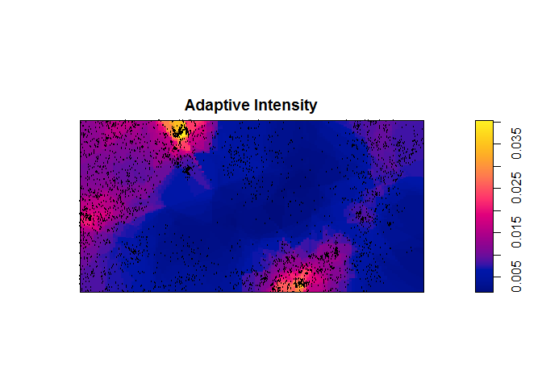 

Again, quadrats don't have to be hexagonal or rectangular and many meaningful tesselation of the region is based on covariates.


```r
Z <- bei.extra$grad  # extract the gradient map covering the region of the point pattern (it's an im object)

b <- quantile(Z, probs=(0:4)/4) # compute the quartiles of gradient values
Zcut <- cut(Z, breaks=b,labels=c('low','mlow','mhigh','high'))   # name the quartiles sensibly
V <- tess(image = Zcut) # create a tess object based on the cuts
plot(V) # this should make it clear what we've done. 
plot(bei,add=T,pch='+')
```

 

```r
qb <- quadratcount(bei,tess=V) # use the tess object to create the quadrats
```

If the regions aren't equal area, then we would need to compute the intensity of the point pattern in each region by dividing the count by the region area. *spatstat* does this for us in the *quadrat.test* function.

So the quadrat method works for covariates that are - or can be made - categorical (as we did in the preceding code block. We can also assume the intensity of the point process is a function of the "continuous" valued covariate, Z. So at any spatial location $s$, $\lambda(s) = \rho(Z(s))$ where $Z$ is the spatial covariate (like the gradient above).  

The function *rhohat* estimates $\rho(Z(s))$ using a variety of methods.

```r
plot(rhohat(bei,Z))
```

 

An important class of covariates are distance maps. Distance maps record the distance in the region from some important features such as water features, intake locations, fault lines, etc. GIS packages have tools to create these but *spatstat* can do it as well.


```r
data(copper) # location of copper finds and covariate data

X <- rotate(copper$SouthPoints, pi/2) # rotate the points
L <- rotate(copper$SouthLines, pi/2) # rotate the fault lines

plot(X, pch = 16, main = "Copper Finds and Fault Lines")
plot(L, add = TRUE) 
```

 

```r
Z <- distmap(L)
plot(L, lwd = 2, main = '')
contour(Z, add = TRUE)
```

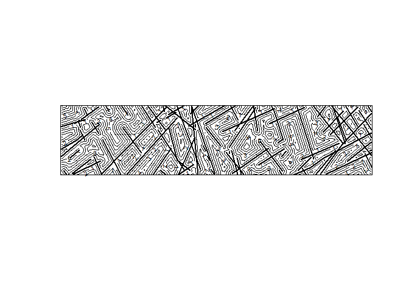 

Now apply the $\rho$ estimate to the distance covariate.


```r
plot(rhohat(X,Z), xlab = 'Z = Distance to Nearest Fault')
```

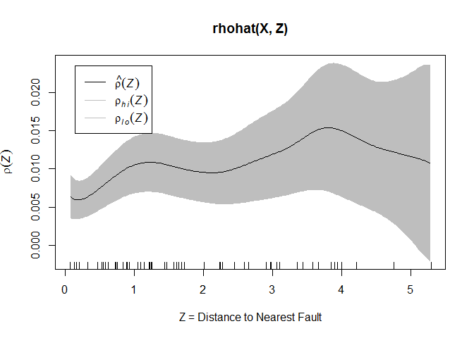 

##Testing for Complete Spatial Randomness (CSR)

We have described $\lambda(s)$ using several methods. But we must be able to quantify the variable insensity and determine if it is reasonable random or truly caused by some spatial process or covariate. We do this by testing the intensity of the point pattern against a concept sometimes called Compete Spatial Randomness (CSR). For a process to be CSR - that is driven by a *uniform Poisson point process* (we demonstrated this in class) with constant intensity, $\lambda$, it must meet these conditions...

1.The number of points $n_a$ falling in any subregion $a$ has a Poisson distribution with $\mu = \lambda * area(a)$,
2.given that there are $n_a$ points in $a$, the locations of those points are i.i.d and uniformly distributed inside $a$, and
3.the contents of two disjoint regions $a$ and $b$ are independent.

CSR is the "null hypothesis" and Pearson's Chi-square Goodness of fit test can be used in the quadrat count method (we saw this in the example in class). This is simple in the *spatstat* package using the command *quadrat.test*. 

Let's look at this 1st order test of homongenous intensity on three generated ppp datasets. One dataset is intended to follow an homogenous poisson process (the complete spatial random set, or CSR), the second dataset is generated using a Matern process which tends to generate clustered point patterns, and the third data uses a Simple Sequential Inhibition (SSI) process to generate a regular point pattern.


```r
this.window = owin(c(0,10),c(0,10))
pp.csr <- rpoispp(1, win=this.window) # intensity ~= 1
pp.cluster <- rMatClust(1,0.2,1,win=this.window) # intensity ~= 1
pp.regular <- rSSI(0.75,100, win=this.window) # intensity = 1 (100 points in 100 units)
```

The command *quadrat.test* uses Pearson's $\chi^2$ statistic, $$ \chi^2 = \sum_{i=1}^{k}[(n_{i,observed} - n_{i,expected})^2/n_{i,expected}]$$ where $n_{i,observed}$ = number of points in quadrat $i$, $n_{i,expected}$ is the number of points in quadrat $i$ predicted by CSR. $n_{i,expected}$, and $k$ is equal to the number of quadrats. 

We compare the $\chi^2$ test statistic to the $\chi^2$ distribution with $k - 1$ degrees of freedom. By default, the two-sided p-value is computed, so that the test will be declared significant if $\chi^2$ is either very large or very small. One-sided p-values can be obtained by specifying the alternative. An important requirement of the $\chi^2$ test is that the expected counts in each quadrat be greater than 5.


```r
csr.test <- quadrat.test(pp.csr,nx=4,ny=4, method = 'Chisq') # Chisq is the default method
```

```
## Warning: Some expected counts are small; chi^2 approximation may be
## inaccurate
```

```r
plot(pp.csr, pch='+', color='black')
plot(csr.test, add=TRUE,  col="red", cex=1.4, lty=2, lwd=3) #pretty plot of the test
```

 

```r
csr.test # print the test results
```

```
## 
## 	Chi-squared test of CSR using quadrat counts
## 	Pearson X2 statistic
## 
## data:  pp.csr
## X2 = 23.7733, df = 15, p-value = 0.1381
## alternative hypothesis: two.sided
## 
## Quadrats: 4 by 4 grid of tiles
```

Note that by plotting the *h.test* object returned from the command, we can see both $n_{i,observed}$ (top left) and $n_{i,expected}$ (top right) in each $i$ quadrat. We also see the contribution of that quadrat to the $\chi^2$ sum in the form of the Pearson resdiual, $Pearson_residual = (n_{i,observed} - n_{i,expected})/\sqrt{n_{i,expected}}$.  

Now, try the clustered pattern.


```r
cluster.test <- quadrat.test(pp.cluster, nx=4, ny=4, method = 'Chisq')
plot(pp.cluster, pch='+', color='black')
plot(cluster.test, add=TRUE, col="blue", cex=1.4, lty=2, lwd=3) #pretty plot of the test
```

 

```r
cluster.test # print the test results
```

```
## 
## 	Chi-squared test of CSR using quadrat counts
## 	Pearson X2 statistic
## 
## data:  pp.cluster
## X2 = 23.7872, df = 15, p-value = 0.1376
## alternative hypothesis: two.sided
## 
## Quadrats: 4 by 4 grid of tiles
```

And, finally the regular pattern.


```r
regular.test <- quadrat.test(pp.regular, nx=4, ny=4, method = 'Chisq')
plot(pp.regular, pch='+', color='black')
plot(regular.test, add=TRUE, col="green", cex=1.4, lty=2, lwd=3) #pretty plot of the test
```

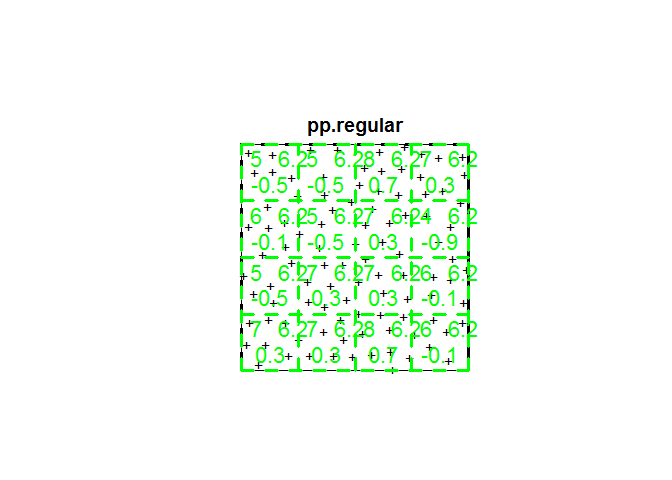 

```r
regular.test # print the test results
```

```
## 
## 	Chi-squared test of CSR using quadrat counts
## 	Pearson X2 statistic
## 
## data:  pp.regular
## X2 = 1.44, df = 15, p-value = 6.445e-06
## alternative hypothesis: two.sided
## 
## Quadrats: 4 by 4 grid of tiles
```

Note the large p-values in the clustered and regular patterns, indicating that these are unlikely outcomes of a uniform Poisson process. 

We can easily run the chi-sqare test on real data.

```r
bei.test <- quadrat.test(bei, nx=6, ny=3, method = 'Chisq')
plot(bei, pch='.', color='black')
plot(bei.test, add=TRUE, col="blue", cex=1.4, lty=2, lwd=3) #pretty plot of the test
```

 

```r
bei.test # print the test results
```

```
## 
## 	Chi-squared test of CSR using quadrat counts
## 	Pearson X2 statistic
## 
## data:  bei
## X2 = 2207.773, df = 17, p-value < 2.2e-16
## alternative hypothesis: two.sided
## 
## Quadrats: 6 by 3 grid of tiles
```

We may also use the Monte Carlo method rather that the $\chi^2$ test. This can be useful if the expected quadrat counts are less than 5. If *method = 'MonteCarlo'* is used then command generates a number (given by parameter *nsim*) of random point patterns with the same region-wide intensity as the point cloud. The $\chi^2$ value is computed then computed using the actual quadrat counts from these CSR patterns as $n_{i,expected}$. The two-sided test is then performed.


```r
bei.test <- quadrat.test(bei, nx=6, ny=3, method = 'MonteCarlo',nsim=100)
plot(bei, pch='.', color='black')
plot(bei.test, add=TRUE, col="red", cex=1.4, lty=2, lwd=3) #pretty plot of the test
```

 

```r
bei.test # print the test results
```

```
## 
## 	Conditional Monte Carlo test of CSR using quadrat counts
## 	Pearson X2 statistic
## 
## data:  bei
## X2 = 2207.773, p-value = 0.0198
## alternative hypothesis: two.sided
## 
## Quadrats: 6 by 3 grid of tiles
```


The high p-value indicates we should reject the null-hypothesis of CSR. Note that this doesn't tell us anything about the variable intenstiy (except the changes by quadrat), only that it doesn't appear to be random.

We can use covariates as well in *quadrat.test*, in this case to define irregular quadrats based on the tesselation of the terrain slope in the region.


```r
# we did all this earlier, but here it is again
Z <- bei.extra$grad
b <- quantile(Z, probs=(0:4)/4)
Zcut <- cut(Z, breaks=b,labels=c('low','mlow','mhigh','high'))
V <- tess(image = Zcut)

# perform the test using the slope tesselation and the Chisq method 
bei.slope.test <- quadrat.test(bei,tess=V, method = 'Chisq')
plot(bei.slope.test)
```

 

```r
bei.slope.test
```

```
## 
## 	Chi-squared test of CSR using quadrat counts
## 	Pearson X2 statistic
## 
## data:  bei
## X2 = 661.8402, df = 3, p-value < 2.2e-16
## alternative hypothesis: two.sided
## 
## Quadrats: 4 tiles (levels of a pixel image)
```

This shows a marked variation across the slope regions we defined. The choice of quadrat size and shape is critical in these tests and must be chosen carefully.

A more powerful test is the Kolmogorov-Smirnov test. The KS test compares the observed and expected distributions of the value of some function $T(s)$ defined at all locations $s$ in the window (ie. region). We evaluate $T(s_j)$ for point $j$ in the pattern. So, for example, we could define $T(grad(s))$ where $grad(s)$ is the value of the gradient at point $s$. In this case, KS is comparing the distribution of slope values at our points with the distribution of all the slope values across the region. The function *cdf.test* implements several cumulative distribution tests on point patterns including the Kolmogrov-Smirnov test. 

```r
bei.slope.ks <- cdf.test(bei,Z,test="ks")
plot(bei.slope.ks)
```

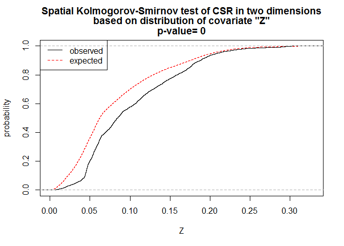 

The plot of the returned object shows the expected distribution of slope values (the cumulative probability a seeing a slope less than Z on the x-axis) in red and the observed cumulative probability of only values at the tree locations. Note that in this case the likelihood of finding trees on slopes less than about 0.20 is lower than we would expect given the distrubion of slope values in the region. 


```r
bei.slope.ks
```

```
## 
## 	Spatial Kolmogorov-Smirnov test of CSR in two dimensions
## 
## data:  covariate 'Z' evaluated at points of 'bei' 
##      and transformed to uniform distribution under CSR
## D = 0.1948, p-value < 2.2e-16
## alternative hypothesis: two-sided
```

The test results again show the improbability of this not be related to slope. 

The KS test is preferred if the covariate is continuous (like slope). If the covariate is a discrete variable (like landcover type) then KS is ineffective because of tied values and the quadrat test using $\chi^2$ is preferred. More information on this might be a good project.

## Using spatial logistic regression

Before we talk about modeling variable intensity in a point pattern, note another method often taught in spatial science classes, the spatial logist regression model. You can keep this in mind as we move forward.


```r
data(copper)
X <- rotate(copper$SouthPoints, pi/2)
L <- rotate(copper$SouthLines, pi/2)
D <- distfun(L)
fit <- slrm(X ~ D)
fit
```

```
## Fitted spatial logistic regression model
## Formula:	X ~ D
## Fitted coefficients:
## (Intercept)           D 
## -4.72337865  0.07811134
```

The fit is $log(p/(p-1)) = intercept + D(s)*X(s)$ where $s$ is the location and $p$ is the probability of finding an event at that location with the "fit" *slrm* object there are methods such as predict that allow you predict the probabilty of an event at a particular location, $s$, given the value of the covariate (in this case, the locations distance from a fault line).


```r
predicted.copper <- predict(fit)
plot(predicted.copper)
plot(X, add=TRUE, pch='+')
```

 

We'll look at this more later.

## Modeling defined inhomogenous or non-stationary Poisson processes

If we assume that no interaction (second order effects) are at work, we can begin to create maximum likliehood models of intensity variations inhomogenous Poisson processes just as we do in other model fitting. The intensity variations can be modeled a function of location in the region or as a function of discrete and/or continuous covariates, or both.

Baddeley provides a little theory in Section 15 of the CSIRO workshop. We'll not discuss that too mucher more here but concentrate instead on the implementation and interpretation of results. 

Let's first consider the case where the intensity of the point pattern is a function of $s$. We can create a random pattern with intensity increasing as you move away from a defined point $s_o$ in or out of the region, for example.


```r
lambda <- function(x,y,xo,yo) {exp(0.1*(x-xo)^2 + 0.1*(y-yo)^2)}
radial.intensity <- rpoispp(lambda,win=owin(c(0,10),c(0,10)),xo=5,yo=5)
plot(radial.intensity)
```

 

As expected, the intensity increases with log of squared distance from the point $s_o = (5,5)$. The goal of MLE is to use the observed point pattern itself to try to estimate parameters of the model. In this case we define the model as increasing intensity as the square of the radius from a point. The parameters we might try to estimate are $x_o$ and $y_o$. Note that we'll always define the logarithm of the intensity. Since the intensity function is non-linear in $x$, $y$, $xo$ and $yo$ this is rather hard to model. It can be done but let's look a function that is log-linear in $x$ and $y$. Assume that our theoretical (ie. physical) model is that the log-intensity increases as we move away from the lower-left corner of the region. Then $\lambda_\theta((x,y)) = exp(\theta_o + \theta_1 x + \theta_2 y)$. Our goal, just as in any regression model is to estimate the $\theta$'s. The MLE estimate (there is no easy way to do this analytically) is computed using the Berman-Turner algorithm. It's not necessary to understand the mechanics, only the purpose and outcome. 

Let's generate a pattern with known parameters and see if we can estimate them.


```r
# define lambda function with vector theta
lambda <- function(x,y,theta) {
  exp(theta[1] + theta[2]*x + theta[3]*y) 
}
known.intensity <- rpoispp(lambda,win=owin(c(0,10),c(0,10)),theta=c(0.1,0.5,0.25))
plot(known.intensity)
```

 

Note that by our definition of $\theta$ the intensity has a base intensity of 1 and increases more in the x-direction and than in the y (by a factor of 2). Let's see if we can accurate estimate these parameters. The modeling workhorse in *spatstat* is *ppm* (for point pattern model). It follows the same syntax and conventions as the other modeling tools in *R*.  

The *ppm* function takes as an argument the *ppm* object and a function (or as we'll see later *im*, *tess* and other objects).  The function defines the log (that's important!) of the intensity trend. 


```r
ppm(known.intensity~x+y)  # The form we're using here is how linear functions can be quickly defined in R using the ~ operator. By default, R assumes that the constant value is included. This is read as known.intensity as a function of x + y
```

```
## Nonstationary Poisson process
## 
## Log intensity:  ~x + y
## 
## Fitted trend coefficients:
## (Intercept)           x           y 
##   0.1638823   0.4957513   0.2462779 
## 
##              Estimate        S.E.    CI95.lo   CI95.hi Ztest      Zval
## (Intercept) 0.1638823 0.043597549 0.07843269 0.2493319   ***   3.75898
## x           0.4957513 0.004512691 0.48690654 0.5045960   *** 109.85712
## y           0.2462779 0.003291808 0.23982608 0.2527297   ***  74.81540
```

Note the estimates. Did our "true" values fall within the (rather large) 95% confidence intervals of the parameters?  This the essence of modeling non-stationary intensity in point patterns. You must always define a parameterized model that predicts intensity as a function of location. 

Can you predict or interpret the estimate obtained by the following call to *ppm*?


```r
ppm(known.intensity~1)
```

```
## Stationary Poisson process
## Intensity: 146.33
##             Estimate        S.E.  CI95.lo  CI95.hi Ztest     Zval
## log(lambda) 4.985864 0.008266722 4.969662 5.002067   *** 603.1247
```

You should try this with other examples to get comfortable with the function notation and what it means. Remember the log-linear relationship of $\lambda$ to $x$ and $y$.

## Covariates as model components

It is also possible to fit an inhomogeneous Poisson process model with an intensity function
that depends on an observed covariate. Let $Z(s)$ be a covariate that has been measured at
every location $s$ in the study window. Then $Z(s)$, or any transformation of it, can serve as the
statistic $S(s)$ in the parametric form of the intensity function. $log\lambda_\theta(s) = \theta S(s)$ where $S(s)$ is a vector-valued function of location $s$.

Since we have covariates for the *bei* dataset let's start with it. We've seen in the previous sections that there is evidence linking the intensity of trees to slope. We may model this explicitly as $\lambda(s) = exp(\beta_0 + \beta_1 Z(s))$ where again, $Z(s)$ is the slope at location $s$ and $\beta_0$ and $\beta_1$ are the parameters to be estimated. The model setup in *spatstat* is


```r
slope <- bei.extra$grad
ppm(bei, ~slope, covariates = slope)  # note the use of ~ again to define a formula or function of slope and the assignment of grad to slope as the covariates
```

```
## Nonstationary Poisson process
## 
## Log intensity:  ~slope
## 
## Fitted trend coefficients:
## (Intercept)       slope 
##   -5.390553    5.022021 
## 
##              Estimate       S.E.   CI95.lo   CI95.hi Ztest       Zval
## (Intercept) -5.390553 0.03001716 -5.449385 -5.331720   *** -179.58236
## slope        5.022021 0.24540264  4.541041  5.503002   ***   20.46441
```

The fitted model is thus $\lambda(s) = exp(-5.390553 + 5.022021 Z(s))$.

What if we wanted the intensity of proportional to slope as in $\lambda(s) = \beta Z(s)$? Then, because we are dealing with log of the intensity we take the log of both sides to get our formula as in $log\lambda(s) = log\beta + logZ(s)$. This gets a little tricky to model since second term has no coefficient. It's just an offset. We can model it this way...


```r
ppm(bei, ~offset(log(slope)), covariates = slope)
```

```
## Nonstationary Poisson process
## 
## Log intensity:  ~offset(log(slope))
## 
## Fitted trend coefficient:  (Intercept) = -2.427127
## 
##              Estimate       S.E.   CI95.lo   CI95.hi Ztest      Zval
## (Intercept) -2.427127 0.01665742 -2.459775 -2.394479   *** -145.7085
```

Here our fitted model becomes $\lambda(s) = e^{-2.427127} Z(s) = 0.0883 Z(s)$.

The next step in any modeling exercise is to check the fit. The function *ppm* returns a fitted model object of type also *ppm* which we can use to assess the quality of the model. Page 100 of the CSIRO workshop has functions that understand fitted pp models. Lets compare our two models for bei intensity relative to slope.


```r
bei.lin.fit <- ppm(bei, ~slope, covariates = slope) # the exponential fit
bei.exp.fit <- ppm(bei, ~offset(log(slope)), covariates = slope) # the linear fit
```

Let's create a prediction of intensity and the standard error (difference between the actual intensity and the predicted intensity) across the window for the exp fit first.


```r
bei.exp.pred <- predict(bei.exp.fit, se = TRUE) 
bei.exp.pred
```

```
## $estimate
## real-valued pixel image
## 128 x 128 pixel array (ny, nx)
## enclosing rectangle: [0, 1000] x [0, 500] metres
## 
## $se
## real-valued pixel image
## 128 x 128 pixel array (ny, nx)
## enclosing rectangle: [0, 1000] x [0, 500] metres
```

Note that this produces two pixel arrays 128 x 128. This is the grid that the fit produced and at which predictions were made and compared to actual local intensity. The *plot* knows how to render these as images.


```r
plot(bei.exp.pred$se, main='Standard error of fitted intensity, exponential model')
```

 

Just as with residuals in a linear model (WLESS), if you see patterns in the residuals, it means you may not have modeled correctly or completely. Let's try the lin.fit...


```r
bei.lin.pred <- predict(bei.lin.fit, se = TRUE) 
bei.lin.pred
```

```
## $estimate
## real-valued pixel image
## 128 x 128 pixel array (ny, nx)
## enclosing rectangle: [0, 1000] x [0, 500] metres
## 
## $se
## real-valued pixel image
## 128 x 128 pixel array (ny, nx)
## enclosing rectangle: [0, 1000] x [0, 500] metres
```

```r
plot(bei.lin.pred$se, main='Standard error of fitted intensity, linear model')
```

 

## Model selection

How do we intelligently choose which model is better? One often used method is the Akaike Information Criterion, or more commonly AIC. In general, the smaller the AIC, the more "efficient" the model. Efficiency is thought as the number of terms required versus the stardard error. 


```r
AIC(bei.lin.fit)
```

```
## [1] 42383.66
```

```r
AIC(bei.exp.fit)
```

```
## [1] 42496.65
```

The linear fit is only slightly better than the exponential fit. It is important to note other methods as well such as analysis of deviance. This particular method can only compare hierarchical models. For example, if you have model that varies with $x$ and one the varies with $x$ and $y$, then the first model is considered a "sub-model" of the second. In this case the function *anova* can be used. See page 103 of the CSIRO workshop for a few more details. 

## Model simulation

Once we have identified one or models, we may use that model to simulate new point patterns using the *rmh* function. 


```r
X <- rmh(bei.exp.fit) 
```

```
## Extracting model information...Evaluating trend...done.
## Checking arguments..determining simulation windows...Evaluating trend integral...
```

```r
plot(X)
```

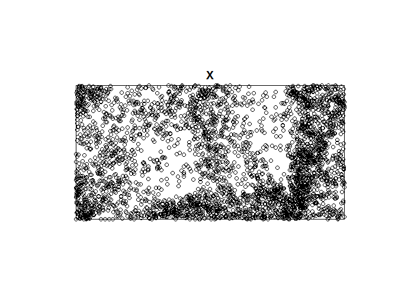 

## Model checking

It is typical to "check" a fitted model for agreement with the data. The check can be a formal hypothesis test ($\chi^2$ tests, goodness-of-fit test, Monte Carlo tests) or Bayesian model selection (another good project idea). Or the check can be informal and visual. Simply viewing plots of residuals can inform the interpretation and analysis of the model.

### $\chi^2$ goodness-of-fit

We've used *quadrat.test* on the point pattern itself, but we can also use it on a *ppm* fit. Under the null hypothesis, the quadrat counts are independent Poisson variables with different mean values, and the means are estimated by the fitted model. 


```r
M <- quadrat.test(bei.exp.fit, nx = 8, ny = 4)
M
```

```
## 
## 	Chi-squared test of fitted Poisson model 'bei.exp.fit' using
## 	quadrat counts
## 	Pearson X2 statistic
## 
## data:  data from bei.exp.fit
## X2 = 2811.671, df = 31, p-value < 2.2e-16
## alternative hypothesis: two.sided
## 
## Quadrats: 8 by 4 grid of tiles
```

Here we've used square quadrats but that really doesn't make sense. Let's try it with the actual tesselation to see if that's any better.


```r
M.tess <- quadrat.test(bei.lin.fit,tess=V, method = 'Chisq')
M.tess
```

```
## 
## 	Chi-squared test of fitted Poisson model 'bei.lin.fit' using
## 	quadrat counts
## 	Pearson X2 statistic
## 
## data:  data from bei.lin.fit
## X2 = 325.6601, df = 2, p-value < 2.2e-16
## alternative hypothesis: two.sided
## 
## Quadrats: 4 tiles (levels of a pixel image)
```

And the $\chi^2$ statistic is much smaller.

The plot produced from this object is similar to the prior plots but instead of comparing the observed intensity to the homogenous intensity, it is comparing the observed intensity to the model predicted intensities in those quadrats (the *$estimate* from before). Large Pearson residuals are gross departures from the model. 


```r
plot(M.tess)
```

 

We may also use the *cdf.test* as before with the fitted model and the covariate.


```r
cdf.test(bei.exp.fit,slope,test="ks") # using slope as the appropriate covariate (the one used in the model)
```

```
## 
## 	Spatial Kolmogorov-Smirnov test of inhomogeneous Poisson process
## 	in two dimensions
## 
## data:  covariate 'slope' evaluated at points of 'bei' 
##      and transformed to uniform distribution under 'bei.exp.fit'
## D = 0.1666, p-value < 2.2e-16
## alternative hypothesis: two-sided
```

###Residual inspection

Residuals from the fitted model are an important diagnostic tool in all areas of applied statistics and can be applied to point pattern intensity analysis as well. For a point pattern with fitted intensity $\hat{\lambda}(s)$ the predicted number of points falling in any region $B$ is $\int_B \! \lambda(s) \, \mathrm{d}s$. For any given region $B$ then, the residual is defined as the number of *observed* points minus the number of *predicted* points. These are of course closely related to the Pearson residuals in the quadrat tests in the previous sections when $B$ is one of the quadrats. 

The preferred method to view the calculate and view the residuals is to compare the fitted model predictions of intensity to an appropriately scaled KDE image of the real data. This is fully implemented in the following function.


```r
diagnose.ppm(bei.exp.fit, which = "smooth", sigma=100)  # exponential file visualized
```

 

```
## Model diagnostics (raw residuals)
## Diagnostics available:
## 	smoothed residual field
## range of smoothed field = [ -0.007393,0.01135 ]
```

```r
diagnose.ppm(bei.lin.fit, which = "smooth", sigma=100)  # linear (or proportional fit visualized)
```

 

```
## Model diagnostics (raw residuals)
## Diagnostics available:
## 	smoothed residual field
## range of smoothed field = [ -0.005926,0.01029 ]
```

This is a powerful function with many options.  The *Lurking variable* plot is a technique worth investigating (another idea for a project). For example, if we wanted to display the residuals against a covariate (slope eg.) then we would plot $C(z) = R(B(z))$ against $z$ where $B(z) = \{u \in W : Z(s) \leq z\}$ is the region of space where the covariate value is less than or equal to $z$.


```r
lurking(bei.exp.fit, slope, type = "raw")
```

 

There is much more to do here but you most, if not all, the tools you'll need to get started analyzing intensity. We'll move on to second order effects now.

#Interaction (second order effect)

This part part of the analysis is tricky because all these techniques assume that clustering or regularity is due NOT to intensity variations in the process, but rather to interactions among the events themselves - be careful here because you have to make an a pretty big leap and a good argument for homogeneity (or stationarity). It is important that you thoroughly investigate first order effects first. Your understanding of intensity variations across the space will inform this part of the analysis. How to discern intensity variations and interaction effects is a key to point pattern analysis and general very difficult.

##Data exploration and "old school" but useful plotting techniques

Data exploration first (as always). First, let's generate some point patterns 1) a true CSR pattern, 2) a clustered pattern and 3) regular pattern (as we did earlier when looking at intensity).


```r
this.window = owin(c(0,10),c(0,10))
pp.csr <- rpoispp(1, win=this.window)
pp.cluster <- rMatClust(1,0.2,3,win=this.window)
pp.regular <- rSSI(0.75,100, win=this.window)
```

There are two simple and often used methods for viewing distances between point pairs. Note that if a pattern has $n$ points then it will have $(n^2)/2-n$ unique interactions (half of the distance matrix minus the zero-valued diagonals).

The Morishita plots is multi-scalar plot that shows chi-squared results at various quadrat sizes. The Morishita index (first published in 1959), $M_i$, is computed as $$M_i = Q * \sum_{n=1}^{Q} (n_i(n_i - 1))/(N(N-1))$$ where $Q$ is the number of quadrats, $n_i$ is the number of points falling in quadrant $i$ and $N$ is the total number of points. If the pattern is completely random then $M_i ~= 1$. Values greater than 1 suggest clustering at that scale.

The Morishita plot is plot of $M_i$ against the linear dimension of the quadrats. The point pattern window is divided first into $2 x 2$ quadrats, then $3 x 3$ quadrats, and so on, with $M_i$ computed each time. 

So, we can regenerate our three patterns (csr, clustered and random) to see how the Morishita plot responds to each.

```r
miplot(pp.csr)
```

 

```r
miplot(pp.cluster)
```

 

```r
miplot(pp.regular)
```

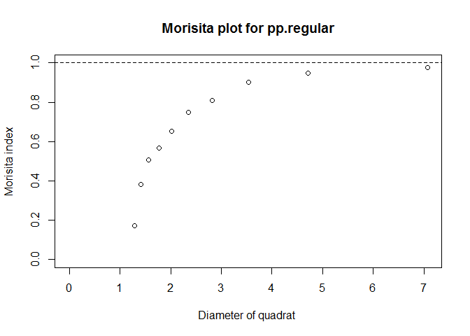 

Notice in particular the multi-scalar aspect of these plots. If we look at the plot of pp.cluster we see less clustering as the size of the quadrat increases.  At about 3 units, no clustering is discernable. That clustering descreases as we increase quadrat size should be intuitive but it is useful to know at what scale that happens. We will see this multi-scalar approach later in the K statistic.

How do the hickory trees in the lansing dataset plot?


```r
data(lansing)
miplot(split(lansing)$hickory)
```

 

You should be able to look at this plot and see at what scale clustering ends.

Another (less useful) graphing method is the Fry plot. The simplest way to explain this is not with a formula but with a graphic description. Assume you've plotted your point patter on a piece of paper. Take a transparent page and draw a red dot in the center. Place the red dot on the transparency at an event and mark all the other events on the transparent page. Move the red dot to the next event and repeat. Do this for for all events. The result is the fry plot.

Once again, let's see how our three patterns plot.


```r
fryplot(pp.csr,char=0.01,pch='.')
```

 

```r
fryplot(pp.cluster,char=0.01,pch='.')
```

 

```r
fryplot(pp.regular,char=0.01,pch='.')
```

 

##Distance based functions                   

As useful as the Morishita and Fry plots can be for getting a sense of 2nd order effects in our pattern, they nevertheless are somewhat qualitative and difficult to interpret. More sophisticated distance-based methods have been developed in an attempt to better assess second order effects in point patterns. Note that when we speak of distances we are generally talking about Euclidean distances. However, other distance measures are possible (Manhattan, Mahalanobias, etc.). We use  $|s_i - s_j|$ to denote a distance (no matter how distance is calculated) between points $s_i$ and $s_j$).

Distance functions generally require one of three possible distance calculations:

1. **Pairwise distance** is the distance between all distinct pairs of points $s_i$ and $s_j$ $\forall i,j$ in the point pattern.


```r
D.pairwise <-  pairdist(pp.csr, squared=FALSE, periodic=TRUE) #returns a matrix
```

Note also that *crossdist* is available which compete distances between points with different marks or different point pattern sets. This results in a generally non-square matrix. 


```r
hickory <- split(lansing)$hickory # separate hickory trees
maple <- split(lansing)$maple # separate maple trees
D.cross <- crossdist(hickory,maple)
```

2. **Nearest neighbor distance** is defined as $t_i = \min(|s_i - s_j|)  \forall j$ so that $t_i$ is the distance from each point $s_i$ to it's nearest neighbor.


```r
D.nn <- nndist(pp.csr, k=1) # returns a vector
D.nn[1:5]  # the distance from the nearest point to the first five points in the ppp object
```

```
## [1] 0.79815739 0.96004689 0.05359775 0.80073202 0.16035662
```

3. **Empty space distance** is defined as $d_u = \min(|u - s_i|) \forall i$ where $d_u$ is the distance from a fixed reference location, $u$ to the nearest point in the pattern. Typical the reference locations are defined on a grid. This is generated by a call to the *distmap* function which saw earlier developing a covariate (distance from a fault line in our example).


```r
D.esd <- distmap(pp.csr)
plot(D.esd, main = "Empty Space Distances")
plot(pp.csr, add=TRUE)
```

 

Note that none of these basic distance functions are edge corrected. Later we'll see functions which are edge corrected.

                   
## Comparing Empty Space Distances (the $F$ function)
                     
The $F$ function is a measure of the distribution of all empty space distance in a point pattern. 

$$\hat{F}(r) = \sum_{k=1}^{m} I_k/m$$ 

$$I_k = 
\left\{
  \begin{array}{ll}
		1 & \mbox{if } d_k \in {d_k:d_k \leq r, \forall k} \\
		0 & \mbox{otherwise } 
	\end{array}
\right.$$

where $d_k = \min_{j}(d_{kj}, \forall j \in S), k = 1,\ldots,m, j = 1,\ldots,n$

It can be shown that a CSR pattern with intensity $\lambda$ would yield $F_{r,csr} = 1 - e^{\lambda\pi r^2}$. So we can plot $F_r$ against $r$ itself.


```r
lambda <- summary(bei)$intensity  # extract the intensity of the bei dataset
F.csr <- function(r) {1 - exp(-lambda*pi*r^2)} # create a function to compute F with at that intensity and at a distance, r
curve(F.csr,0,10) # draw a curve of F computed at r = 0, 1, ..., 9, 10
```

 

The *spatstat* function, *Fest* offers a convenient to compute *F_r* for a point pattern along with $F_{r,csr}$ in a single command. For example, for the *bei* point pattern of 3604 points in 1000 x 500 meter window...


```r
F.bei <- Fest(bei)                     
plot(F.bei)
```

 

```
##      lty col  key                   label
## km     1   1   km   italic(hat(F)[km](r))
## rs     2   2   rs italic(hat(F)[bord](r))
## cs     3   3   cs   italic(hat(F)[cs](r))
## theo   4   4 theo      italic(F[pois](r))
##                                meaning
## km       Kaplan-Meier estimate of F(r)
## rs   border corrected estimate of F(r)
## cs        Chiu-Stoyan estimate of F(r)
## theo          theoretical Poisson F(r)
```

This produces several estimates of $F_r$ and compares them $F_{r,csr}.


```r
plot(F.bei, theo ~ r, main = 'Theoretical')
```

 

```r
plot(F.bei, rs ~ r, main = 'border corrected') 
```

 

```r
plot(F.bei, cbind(rs, theo) ~ r)
```

 

```
##      lty col  key                   label
## rs     1   1   rs italic(hat(F)[bord](r))
## theo   2   2 theo      italic(F[pois](r))
##                                meaning
## rs   border corrected estimate of F(r)
## theo          theoretical Poisson F(r)
```

These are obviously similar to expected F for a CSR
                     
let's see how different patterns behave                     

```r
plot(Fest(pp.csr),rs ~ r, lty=2)
plot(Fest(pp.regular), rs ~ r, add=TRUE, col='blue')
plot(Fest(pp.cluster), rs ~ r, add=TRUE, col='red')
```

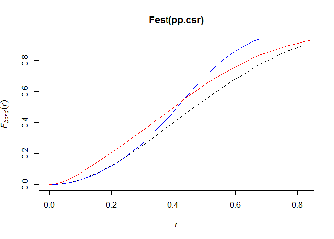 

 NEAREST NEIGHBOR DISTANCES (the G function)

The cumulative distribution function G(r) = P{d(u,X \ {u}), u is an element of X}
 for a homongenous Poisson process Gpois(r) = 1 - exp(-lambda*pi*r^2)  (same as F, right?)

```r
Gbie <- Gest(bei)
plot(Gbie)                     
```

 

```
##      lty col  key                   label
## km     1   1   km   italic(hat(G)[km](r))
## rs     2   2   rs italic(hat(G)[bord](r))
## han    3   3  han  italic(hat(G)[han](r))
## theo   4   4 theo      italic(G[pois](r))
##                                meaning
## km       Kaplan-Meier estimate of G(r)
## rs   border corrected estimate of G(r)
## han           Hanisch estimate of G(r)
## theo          theoretical Poisson G(r)
```

If events are closely clustered space, G increases rapidly at short distances

```r
G.cluster <- Gest(pp.cluster)
plot(G.cluster)
```

 

```
##      lty col  key                   label
## km     1   1   km   italic(hat(G)[km](r))
## rs     2   2   rs italic(hat(G)[bord](r))
## han    3   3  han  italic(hat(G)[han](r))
## theo   4   4 theo      italic(G[pois](r))
##                                meaning
## km       Kaplan-Meier estimate of G(r)
## rs   border corrected estimate of G(r)
## han           Hanisch estimate of G(r)
## theo          theoretical Poisson G(r)
```

What happens if event are more regular

```r
G.regular <- Gest(pp.regular)                     
plot(G.regular)
```

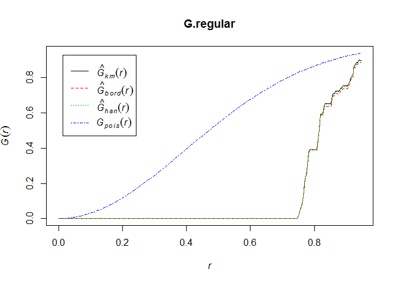 

```
##      lty col  key                   label
## km     1   1   km   italic(hat(G)[km](r))
## rs     2   2   rs italic(hat(G)[bord](r))
## han    3   3  han  italic(hat(G)[han](r))
## theo   4   4 theo      italic(G[pois](r))
##                                meaning
## km       Kaplan-Meier estimate of G(r)
## rs   border corrected estimate of G(r)
## han           Hanisch estimate of G(r)
## theo          theoretical Poisson G(r)
```
 
 PAIRWISE DISTANCES (the K function)
 the observed distances in a point pattern constitute a biased sample of pairwise distances
 in the process, favoring smaller distances (since we'll never observe a distance large than the window)

Ripley defined the K-function so that lambda*K(r) is the expected number of points in the process within a distance r of a typical point of the process
 Kpois = pi * r^2 (it doesn't depend on the intensity)

```r
K.csr <- Kest(pp.csr)
plot(K.csr)    
```

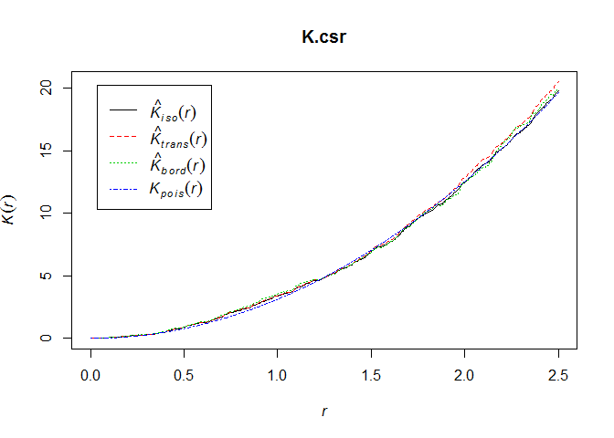 

```
##        lty col    key                    label
## iso      1   1    iso   italic(hat(K)[iso](r))
## trans    2   2  trans italic(hat(K)[trans](r))
## border   3   3 border  italic(hat(K)[bord](r))
## theo     4   4   theo       italic(K[pois](r))
##                                       meaning
## iso      isotropic-corrected estimate of K(r)
## trans  translation-corrected estimate of K(r)
## border      border-corrected estimate of K(r)
## theo                 theoretical Poisson K(r)
```

Computing envelopes using Monte Carlo techniques (Baddelley, page 132)

```r
K.regular.env <- envelope.ppp(pp.regular,Kest,nsim=39,rank=1)                     
```

```
## Generating 39 simulations of CSR  ...
## 1, 2, 3, 4, 5, 6, 7, 8, 9, 10, 11, 12, 13, 14, 15,
## 16, 17, 18, 19, 20, 21, 22, 23, 24, 25, 26, 27, 28, 29, 30,
## 31, 32, 33, 34, 35, 36, 37, 38,  39.
## 
## Done.
```

```r
K.cluster.env <- envelope.ppp(pp.cluster,Kest,nsim=39,nrank=1)
```

```
## Generating 39 simulations of CSR  ...
## 1, 2, 3, 4, 5, 6, 7, 8, 9, 10, 11, 12, 13, 14, 15,
## 16, 17, 18, 19, 20, 21, 22, 23, 24, 25, 26, 27, 28, 29, 30,
## 31, 32, 33, 34, 35, 36, 37, 38,  39.
## 
## Done.
```

```r
K.csr.env <- envelope.ppp(pp.csr, Kest, nsim=39, nrank=1)
```

```
## Generating 39 simulations of CSR  ...
## 1, 2, 3, 4, 5, 6, 7, 8, 9, 10, 11, 12, 13, 14, 15,
## 16, 17, 18, 19, 20, 21, 22, 23, 24, 25, 26, 27, 28, 29, 30,
## 31, 32, 33, 34, 35, 36, 37, 38,  39.
## 
## Done.
```

Note that Kest can be border/edge corrected. See ?Kest
         
 another commonly used statistic the transformed K value, L, of course.
 L(r) = sqrt(K(r)/pi) which makes a L of a poisson process a straight line


```r
L.csr <- Lest(pp.csr)
plot(L.csr)
```

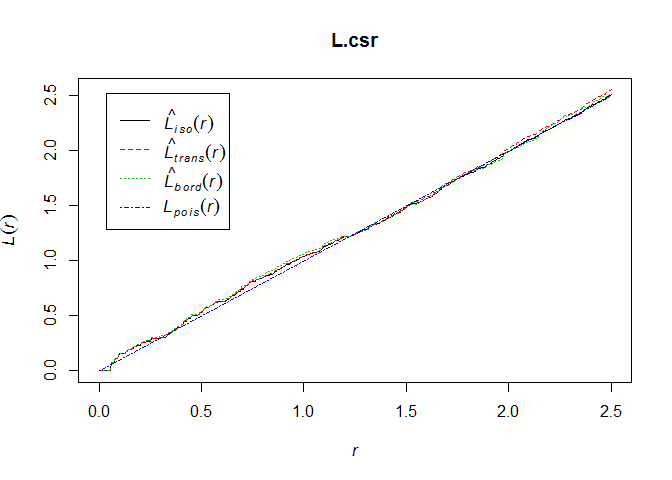 

```
##        lty col    key                    label
## iso      1   1    iso   italic(hat(L)[iso](r))
## trans    2   2  trans italic(hat(L)[trans](r))
## border   3   3 border  italic(hat(L)[bord](r))
## theo     4   4   theo       italic(L[pois](r))
##                                       meaning
## iso      isotropic-corrected estimate of L(r)
## trans  translation-corrected estimate of L(r)
## border      border-corrected estimate of L(r)
## theo                 theoretical Poisson L(r)
```


```r
L.cluster <- Lest(pp.cluster)
plot(L.cluster)
```

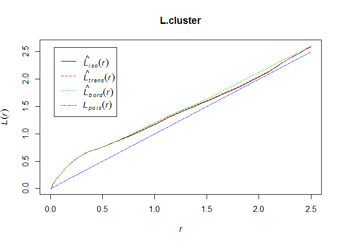 

```
##        lty col    key                    label
## iso      1   1    iso   italic(hat(L)[iso](r))
## trans    2   2  trans italic(hat(L)[trans](r))
## border   3   3 border  italic(hat(L)[bord](r))
## theo     4   4   theo       italic(L[pois](r))
##                                       meaning
## iso      isotropic-corrected estimate of L(r)
## trans  translation-corrected estimate of L(r)
## border      border-corrected estimate of L(r)
## theo                 theoretical Poisson L(r)
```

Also the J function J(r) = (1 - G(r))/(1-F(r))  so that Jpois(r) = 1
J(r) > 1 suggest regularity, J(r) < 1 suggest clustering

you could just do this...

```r
plot(allstats(bei))
```

 
                     
 CAVEATS TO ALL OF THE PRECEDING
 1. F,G, and K are defined and estimated under the assumption that the point process is homogenous

 2. summary functions do not characterize the process (that's model fitting)

 3. if the process is not homogenous, deviations between thereotical and empirical are not evidence (necessarily) of interpoint interaction, since they may also be attributable to variations in intensity
                     
 for example, #3

```r
X <- rpoispp(function(x,y){300*exp(-3*x)})
X
```

```
## planar point pattern: 115 points
## window: rectangle = [0, 1] x [0, 1] units
```
                     
                     
                     
                     
                     
                     
                     
