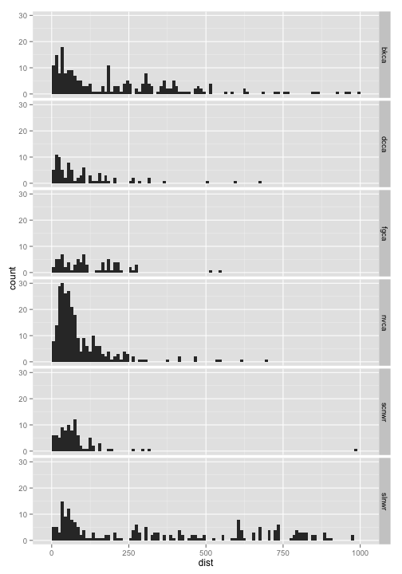
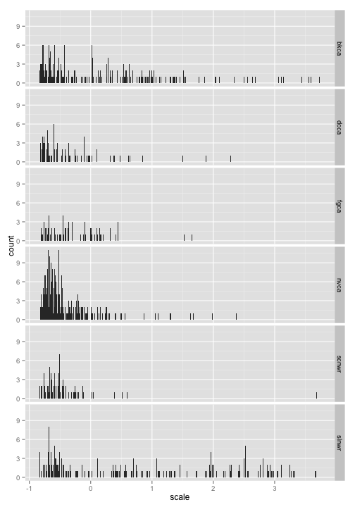
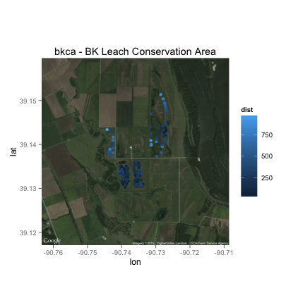
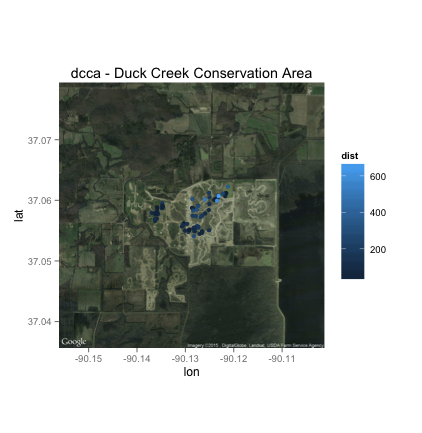
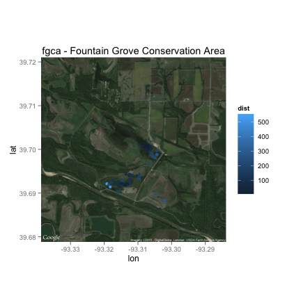
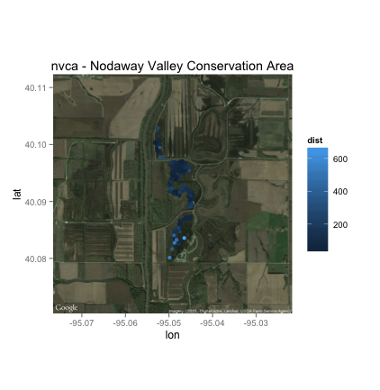
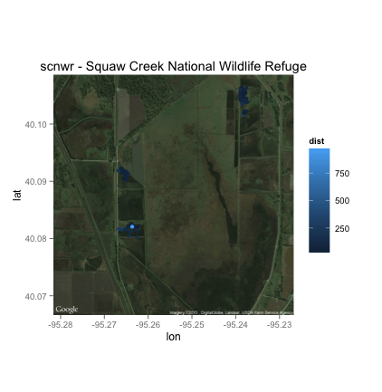
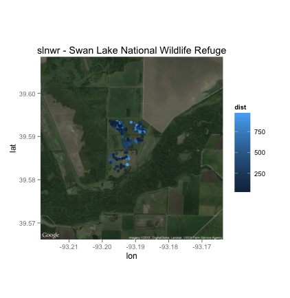

# Evaluating differences between observers surveying for rails at night on ATVs
## Auriel M.V. Fournier

## Introduction

Rails are difficult to detect, which makes surveying for them, and assessing the success of those surveys challenging [@Conway2010; @Melvin1996a]. Detecthing rails is difficult because rails do not vocalize regularly in the fall, do not respond to vocalizations, and spend most of their time in dense vegetation [@Conway2010; @Budka2013;@Conway2010b;@Conway]. Rails are also reluctant to flush out until you are very close to them. This is one of the reasons they are the least studied group of birds in North America and why there are no standard survey methods for them outside of the breeding season [@Conway2011]. 

My projects overall goal is to understand how different kinds of wetland management impact both rails and watefowl during their fall migration. The bulk of our data collection is done by going out and surveying the locations of birds wetland impoundments. In 2013 and 2014 my project did double surveys each night, in which a wetland impoundment was surveyed two times, by two different people, in a short period of time (3 hours). These surveys are done from ATVs driving transects after sunset with a spotlight under a distance sampling framework. Hierarchical models are used to take the distance from the survey line to estimate detection probability and generate abundance estimates [@K2006a; @Thomas2010; @Royle2004]. 

Rails are diurnal, and other than responding to our presence in the wetland at night we are assuming that they are sleeping . We did some preliminary telemetry work tracking rail's response to ATVs during the past two falls (n=6) and have not detected one moving more then 10 meters in response to an ATV. As a result we hope these two surveys on the same night are surveying the same birds in roughly the same locations. Here I use point pattern analysis to examine the differences in marked point patterns from the same night and compare the distances between them and their nearest neighbor.

## Methods

I have a marked point patterns of observations of Sora (*Porzana carolina*) on 13 public properties in 45 different wetland impoundments across 6 months of surveys (3 months in each year). I will summarize the differences in pattern at the wetland level, as that is the unit of interest to my project as a whole because that is the scale management decisions are made on. 

We had four observers (four in 2013 and two returning in 2014). For the purposes of this project we are just going to look at 2014, since there are only two observers so its simpler. If these patterns work for two observers I will expand the analysis to the four from 2013 in the future. 

First I subsetted the 2014 data and removed four of the sites because they had very few observations and were creating very high distance values. Then I re-projected it from lat/long to UTM. 

```r
library(ggplot2)
```

```r
library(rgdal)
```

```r
library(gridExtra)
```

```r
library(AICcmodavg)
library(spatstat)
```

```r
setwd("/Users/AurielFournier/Documents/data")
dat <- read.csv("all_birds.csv")
dat <- na.omit(dat)
dat <- dat[dat$species=="sora",]
## I am removing these three sites because they have very few points, and were causing most, but not all of the issues with outliers. These four sites are Ten Mile Pond Conservation Area (tmpca), Otter Slough Conservation Area (osca), Clarence Cannon National Wildlife Refuge (ccnwr) and Ted Shanks Conservation Area (tsca)
dat <- dat[dat$canwr!="tmpca"&dat$canwr!="osca"&dat$canwr!="ccnwr"&dat$canwr!="tsca",]

## reprojecting the points into utm 
utm <- as.data.frame(project(cbind(dat$long, dat$lat), "+proj=utm +zone=15 ellps=WGS84"))
colnames(utm) <- c("utm_w","utm_n")

dat <- cbind(dat, utm)
# taking only the 2014 points
dat4 <- dat[dat$year==2014,]

#figuring out how many unique survey days we have. jdate = julian date
jdate4 <- unique(dat4$jdate)
```

Then I created a list where each object in the list is a data frame of the observations from a ginle unique night of surveys. 


```r
# creating list to put each days points into seperately. 
list4 <- list()
## so this takes each day adn makes a list with each unique date being a level in the lsit
# removes days in which only one observer saw birds
for(i in 1:length(jdate4)){
  dat <- dat4[dat4$jdate==jdate4[i],]
  if (length(unique(dat$obs))>1){
  list4[[i]] <- dat}
}

## 
```

Then I wrote a for loop to use the crossdist function from the spatstat package to calculate the distance from each point by observer A to each point by observer B and vise versa. These are then rbind-ed together into one master dataset. 


```r
dist4 <- list()
newdf <- list()

dista <- list()
newdfa <- list()
for (i in c(1:length(list4))){
  # takes one element out of the list and makes it a data frame
  df <- as.data.frame(list4[[i]])
  if (nrow(df)>1){
    # splits the points from one night into two point patterns, one for me (A) and one for Nick (N)
    a <- df[df$obs=="N",]
    b <- df[df$obs=="A",]
    # figures out the distance between all the a points and the n points
    cdf <- crossdist(a$utm_w, a$utm_n, b$utm_w, b$utm_n)
    # finds the shortest distance for each point (row)
    c <- apply(cdf, 1, min)
    #figures out the distance between all the n points and the a points
    cdf2 <- crossdist(b$utm_w, b$utm_n, a$utm_w, a$utm_n)
    # finds the shortest distance for each point (row)
    d <- apply(cdf2, 1, min)
    # cbinding together the distances with their respective points, then stacking the points together with rbind into a new data frame for that particular jdate, and putting it in it's own object in this new list. 
    newdfa[[i]] <- rbind(cbind(a, dist=c),cbind(b,dist=d))
  }
  }
  
# binding together all the objects from the above for loop
dist <- do.call(rbind, newdfa)
# cutting out the outliers (those over 1000 meters, which are all instances where the nearest point was in an entirely different survey unit)
dist <- dist[dist$dist<=1000,]

dist$scale <- as.numeric(scale(dist$dist))
```

# Results


```r
ggplot()+
  geom_histogram(data=dist, aes(x=dist), binwidth=10)+
  facet_grid(canwr ~ .)
```

 

**Figure 1 - Histogram of distances by conservation area/national wildlife refuge**

```r
ggplot()+
  geom_histogram(data=dist, aes(x=scale), binwidth=0.01)+
  facet_grid(canwr ~ .)
```
 

**Figure 2 - Histogram of scaled distances by conservation area/national wildlife refuge**

None of these distributions appear normal via visual assessment and I ran a Z-test on each of the scaled values to quanitaitvely assess this. They are significantly different then a normal distribution. 

```r
uni <- unique(dist$canwr)

canwr <- list()

for(i in 1:6){
  canwr[[i]] <- dist[dist$canwr==uni[i],]
}

library(BSDA)
```

```r
z <- list()

for(i in 1:6){
  df <- canwr[[i]]
  z[[i]] <- z.test(df$scale, mu=0, sigma.x=1)
}

z
```

```

## [[1]]
## 
## 	One-sample z-Test
## 
## data:  df$scale
## z = 11.17, p-value < 2.2e-16
## alternative hypothesis: true mean is not equal to 0
## 95 percent confidence interval:
##  0.6416 0.9147
## sample estimates:
## mean of x 
##    0.7782 
## 
## 
## [[2]]
## 
## 	One-sample z-Test
## 
## data:  df$scale
## z = -6.682, p-value = 2.363e-11
## alternative hypothesis: true mean is not equal to 0
## 95 percent confidence interval:
##  -0.5319 -0.2906
## sample estimates:
## mean of x 
##   -0.4112 
## 
## 
## [[3]]
## 
## 	One-sample z-Test
## 
## data:  df$scale
## z = -3.158, p-value = 0.001589
## alternative hypothesis: true mean is not equal to 0
## 95 percent confidence interval:
##  -0.5584 -0.1307
## sample estimates:
## mean of x 
##   -0.3446 
## 
## 
## [[4]]
## 
## 	One-sample z-Test
## 
## data:  df$scale
## z = 2.642, p-value = 0.008249
## alternative hypothesis: true mean is not equal to 0
## 95 percent confidence interval:
##  0.04596 0.31024
## sample estimates:
## mean of x 
##    0.1781 
## 
## 
## [[5]]
## 
## 	One-sample z-Test
## 
## data:  df$scale
## z = -2.338, p-value = 0.01936
## alternative hypothesis: true mean is not equal to 0
## 95 percent confidence interval:
##  -0.48670 -0.04286
## sample estimates:
## mean of x 
##   -0.2648 
## 
## 
## [[6]]
## 
## 	One-sample z-Test
## 
## data:  df$scale
## z = -4.356, p-value = 1.322e-05
## alternative hypothesis: true mean is not equal to 0
## 95 percent confidence interval:
##  -0.6658 -0.2526
## sample estimates:
## mean of x 
##   -0.4592
```
Next I ran a linear model to see if distance could be explained by differences in property, and the model came out with all parameters being significant, though the R^2 is low (22). 


```r
model <- lm(data=dist, dist ~ canwr)
summary(model)
```

```
## 
## Call:
## lm(formula = dist ~ canwr, data = dist)
## 
## Residuals:
##    Min     1Q Median     3Q    Max 
## -348.0  -87.3  -35.1   65.2  898.5 
## 
## Coefficients:
##             Estimate Std. Error t value Pr(>|t|)    
## (Intercept)    220.5       12.9   17.07  < 2e-16 ***
## canwrdcca     -113.4       24.6   -4.61  4.5e-06 ***
## canwrfgca      -96.1       25.3   -3.80  0.00015 ***
## canwrnvca     -127.9       17.5   -7.31  5.8e-13 ***
## canwrscnwr    -138.3       24.0   -5.77  1.1e-08 ***
## canwrslnwr     130.2       18.6    7.01  4.6e-12 ***
## ---
## Signif. codes:  0 '***' 0.001 '**' 0.01 '*' 0.05 '.' 0.1 ' ' 1
## 
## Residual standard error: 192 on 936 degrees of freedom
## Multiple R-squared:  0.224,	Adjusted R-squared:  0.22 
## F-statistic:   54 on 5 and 936 DF,  p-value: <2e-16
```

These differences may be related to the habitat at each area, which does vary, and the density of birds we observed, since some properties have higher bird densities, which increases our chances of having points close together and may impact detection probability. 


Next I looked at the spatial distribution of the points, each one colored by it's distance from its nearest neighbor in the other set of points. These are all the points for the entire year. 

 
 
 
 
 
 

**Figure 3 - Detection locations of birds on each property**

# Discussion

In 2013 and 2014 we deployed radio transmitters on rails and tracked them in response to the ATVs. We never observed a rail moving more then 10 meters from its original location in response to an ATV. Based on our efforts catching rails at night we know once they fly/or run from an ATV they typical land 5-10 meters away and stay where they land. At night the rails are sleeping and we assume they return to sleeping after we disturb them. Based on this I do not think they are actively moving around the impoundment during the night, at least not large distances. But our sample size (n=6) could bias our assumptions.

Based on the model outputs from the distance sampling based surveys - the surveys which generated these point patterns -  detection probability for a Sora is low (<30%). Most points nearest neighbor being >50m isn't surprising. With only a 30% chance of seeing an individual bird any instances where we see 'the same bird' on two seperate surveys is unlikely. This does bring into question the value of repeating surveys, 

What I find intriguing is the farther distance points are clustered and based on my knowledge of the area this makes sense. These areas with farther distance points are covered in very thick/tall vegetation that rails often do not select these habitats to use and makes detection difficult and detection probability may be lower there (<15%). 

For the time being I will not be expanding this project to the 2013 data since th3 2014 data has reinforced my ideas that detection is low, but this analysis does prompt thinking about how we should be thinking about repeat surveys  

# References
