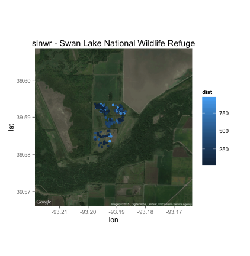
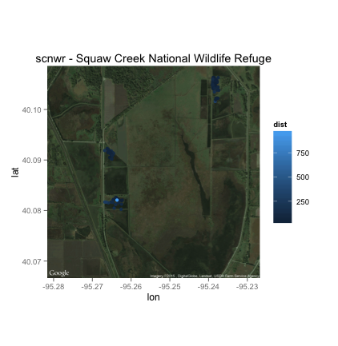
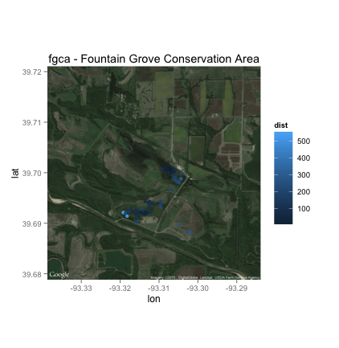
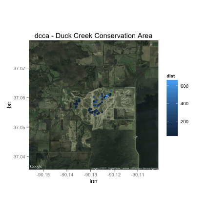
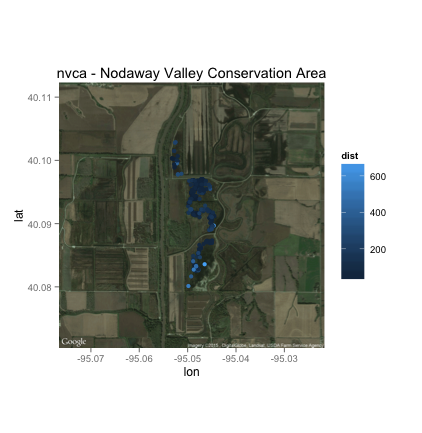
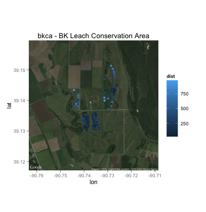

---
output:
  pdf_document: default
  html_document:
    keep_md: yes
header-includes:
  - \setlength\parindent{24pt}
linestretch: 1.6
bibliography: final_project.bib
csl: ecology.csl
---


# Evaluating differences between observers surveying for rails at night on ATVs
## Auriel M.V. Fournier

## Introduction

Secretive marsh birds, including Yellow Rail (*Coturnicops noveboracensis*), Black Rail (*Laterallus jamaicensis*), King Rail (*Rallus elegans*), Virginia Rail (*R. limicola*), and Sora (*Porzana carolina*), use wetlands across North America throughout the year. Recent evidence suggests secretive marsh bird populations are in decline; their decline may be related to loss of palustrine emergent wetlands across the continent [@Valente2011; @Eddleman1988a; @Tiner1984]. While researchers have conducted work on rail habitat preferences and breeding ground biology, little is known about the timing of rail fall migration and habitat use [@Bookhout1995a; @Conway1995a; @Melvin1996a; @Poole2005]. Early fall is a critical time in the annual cycle of birds migrating through mid-latitude states due to the loss of historic wetlands (Missouri has lost 87% of its historic wetland acres) and local precipitation patterns (August is typically the driest month of the year in Missouri) which often result in limited available water on the landscape. Because habitat is more limited, fall is thought to be an optimal time to examine vital rates because birds will be more concentrated in the available habitat [@Strategy2009]. The objectives of our study are:

- Identify habitat characteristics of locations used by rails in the fall in four regions of Missouri,

- Estimate rail occupancy rates and abundance in relation to water level management and wetland habitat management regimes during fall migration.

Rails are very difficult to detect, which makes surveying for them, and assessing the success of those surveys challenging. Most breeding birds in North America are monitored using the Breeding Bird Survey coordinated by the U.S. Geological Survey  [@Sauer2005]. This survey relies on road based point counts to listen for singing birds across North America which are surveyed each year. This data set has been instrumental in examining the range shifts and population changes in many species but is not effective for rails because of their secretive nature, low vocalization rate, and their avoidance of distributed habitats [@Conway2011; @Monfils2013; @Sauer2005; @Allen2012a]. Because of this deficient Conway [-@Conway2011] developed a series of passive listening and broadcasting of rail calls to prompt a response which is known as the National Marshbird Monitoring Protocol and has been shown to be effective for all but Black and Yellow Rails [@Conway2011]. This method is only viable during the spring and summer months when rails are breeding and defending territories, during the fall they do not readily respond to vocalization and because they rarely fly during daylight hours and spend their time in very dense vegetation assessing their habitat can be very challenging. Even when approached they are often reluctant to flush out of the vegetation until you are very close to them. This is one of the reasons they are the least studied group of birds in North America and why there are no standard survey methods for them outside of the breeding season [@Conway2011]. 

Rails live in a wide variety of wetlands, from coastal tidal marshes to restored wetlands surrounded by levees and heavy managed with earth moving equipment. These habitats create a unique set of challenges to surveying because each one is difficult for people to traverse it a unique way. Often in wetlands air boats are used when water levels are high enough to both survey and capture rails [@Perkins2010]. When water levels are too low, or air boats are unavailable (in many inland areas) ATVs can be useful in inland wetlands which dry at least once a year and still have solid earth. Constantly flooded and tidal systems often have deep sediment layers which make ATVs inefficient. Perkins [-@Perkins2010] compared the use of ATVs and air boats in capturing rails and found that in wetland where air boats can be used they are much more efficient. But in systems where air boats cannot be used the utility of ATVs for surveying has not been examined and is needed to help us address the priority information needs for secretive marsh birds identified by the Migratory Shore and Upland Game Bird Support Task Force [@Strategy2009]. Migration is thought to be a time of high mortality, but little is known about habitat use, and the timing, mortality or other aspects of rail migration ecology. 

My projects overall goals are to understand how different kinds of wetland management impact both rails and waterfowl during their fall migration and how this impacts their survival. In 2013 and 2014 my project did double surveys each night, in which a wetland impoundment was surveyed two times, by two different people, in a short period of time (3 hours). These surveys are done from ATVs driving transects after sunset with a spotlight. Since rails are active during the day other then responding to our presence in the wetland we are assuming that they are sleeping or still the rest of the night. As a result we hope that these two surveys on the same night are surveying the same birds in roughly the same locations. TO address these and other objectives we need a repeatable survey method that allows us to understand the habitat use of rails outside the breeding season. I will examine the distance between rail observation points on the same night by different observers to examine the repeatability of our methodology. 

## Methods

### Study Species

While my project looks at all migratory rails most (>95%) of our detections are of Sora (*Porzana carolina*) a rail which is widespread, though not often abundant across most of North America and lives in moist soil wetlands without heavy woody vegetation [@Melvin1996a]. Because Sora make up most of my detections we will only use Sora detections in our analysis. Our hope is that these results would also reflect the other rails species, but additional work will need to be done to examine those assumptions. Sora are migratory, spending their winters on the gulf coast and down into Mexico and their summers in the Upper Midwestern United States and up into the central provinces of Canada. They are a game bird in most states/provinces where they occur and were a actively pursued gamebird historically but are rarely hunted now. 

### Study Sites

We surveyed marsh impoundments across the northern and eastern portion of the state of Missouri. We selected four regions (northwest, north central, northeast and southeast) because of their historic importance for both migrating waterfowl and rails and the active wetland management occurring in these locations. Each region included state Conservation Areas (CA) managed by the Missouri Department of Conservation (MDC) and one National Wildlife Refuge (NWR) managed by the U.S. Fish and Wildlife Service (USFWS).


### Field Methods

We surveyed for the presence of Yellow Rail, Virginia Rail, King Rail and Sora nocturnally using ATVs and spotlights. We detected rails by slowly driving (average 4 km/hour) along transects through the impoundments sweeping back and forth with a spotlight and recording the coordinates of every rail we saw on the ground or flushed into the air and the distance from the transect line to the point of detection. In 2013 and 2014 we surveyed for three hours each night. The three hours were split up into two one and one half hour blocks and each impoundment was surveyed twice during each night of surveying, by two different observers.

We began surveys each year in the NW region and move clockwise around the state, spending 4-5 nights in each part of the state. In 2014 we visited all regions of the state four times (August 11-October 22). In 2013 we visited state properties three times and federal properties four times (August 13 - October 14 and August 13 - October 29 respectively). 

Areas surveyed varied among years. We did not survey at Mingo NWR in 2014. We did not survey Bob Brown and Grand Pass CAs in 2013 or 2014 because we were able to and sufficient areas on the other properties. We began surveying at Ten Mile Pond CA in 2014. Surveys at Ted Shanks CA and Clarence Cannon NWR in 2013 were limited because of extensive flooding during the summer of 2013.We did not survey at Clarence Cannon or Mingo NWRs in the third round of surveys in 2013 because of the federal government shutdown.

### Behavioral Response of Rails to ATVs

We captured Soras in various habitats across the study area. We released the bird with a VHF transmitter at the point of capture and monitored the bird each day for 2-3 days afterwards to ensure the transmitter had not affected the bird's ability to move or fly. After sunset we located the bird and signaled the ATV driver who was positioned 30 m away to drive through the area where the marked bird was located. We monitored the location of the marked bird while the ATV passed by the bird's position to determine how the marked bird responded to the ATV. We recorded whether the rail moved and how far. We then recaptured rail, removed transmitter, and released the rail.

### Statistical Methods

I have a marked point patterns of observations of Sora on 13 different public properties in 45 different wetland units across 6 months of surveys (3 months in each year). I will summarize the differences in pattern at the wetland level, as that is the unit of interest to my project as a whole and is the unit at which we consider the survey to be completed. 

Across that time period we had four different observers (four in 2013 and two returning in 2014). For the purposes of this project we are just going to look at 2014, since there are only two observers so its simpler. If these patterns work for two observers I will expand them to the four from 2013 in the future. 

First I subsetted out the 2014 data and removed four of the sites because they had very few observations and were creating very high distance values. Then I re-projected it from lat/long to UTM. 

```{r, results='hide', warning=FALSE, message=FALSE}
library(ggplot2)
library(rgdal)
library(gridExtra)
library(AICcmodavg)
library(spatstat)
library(metafor)
library(BSDA)
```

```{r}
setwd("~/Documents/data")
dat <- read.csv("all_birds.csv")
dat <- na.omit(dat)
dat <- dat[dat$species=="sora",]
## I am removing these three sites because they have very few points, and were causing most, but not all of the issues with outliers. These four sites are Ten Mile Pond Conservation Area (tmpca), Otter Slough Conservation Area (osca), Clarence Cannon National Wildlife Refuge (ccnwr) and Ted Shanks Conservation Area (tsca)
dat <- dat[dat$canwr!="tmpca"&dat$canwr!="osca"&dat$canwr!="ccnwr"&dat$canwr!="tsca",]
## reprojecting the points into utm 
utm <- as.data.frame(project(cbind(dat$long, dat$lat), "+proj=utm +zone=15 ellps=WGS84"))
colnames(utm) <- c("utm_w","utm_n")
dat <- cbind(dat, utm)
# taking only the 2014 points
dat4 <- dat[dat$year==2014,]
#figuring out how many unique survey days we have. jdate = julian date
uni <- unique(dat$jdate)
```

Then I created a list where each object in the list is a data frame of just the observations from that day. 

```{r}
# creating list to put each days points into seperately. 
list4 <- list()
for(i in 1:29){
  list4[[i]] <- dat[dat$jdate==uni[i],]
}
```

Then I wrote a for loop to use the crossdist function from the spatstat package to calculate the distance from each point to every other point in another set of points, and vise versa. These are then rbind-ed together into one master dataset. 

```{r, warning=FALSE, message=FALSE}
dist4 <- list()
newdf <- list()
dista <- list()
newdfa <- list()
for (i in c(1:length(list4))){
  # takes one element out of the list and makes it a data frame
  df <- as.data.frame(list4[[i]])
  if (nrow(df)>1){
    # splits the points from one night into two point patterns, one for me (A) and one for Nick (N)
    a <- df[df$obs=="N",]
    b <- df[df$obs=="A",]
    # figures out the distance between all the a points and the n points
    cdf <- crossdist(a$utm_w, a$utm_n, b$utm_w, b$utm_n)
    # finds the shortest distance for each point (row)
    c <- apply(cdf, 1, min)
    #figures out the distance between all the n points and the a points
    cdf2 <- crossdist(b$utm_w, b$utm_n, a$utm_w, a$utm_n)
    # finds the shortest distance for each point (row)
    d <- apply(cdf2, 1, min)
    # cbinding together the distances with their respective points, then stacking the points together with rbind into a new data frame for that particular jdate, and putting it in it's own object in this new list. 
    newdfa[[i]] <- rbind(cbind(a, dist=c),cbind(b,dist=d))
  }
  }
# binding together all the objects from the above for loop
dist <- do.call(rbind, newdfa)
# cutting out the outliers (those over 1000 meters, which are all instances where the nearest point was in an entirely different survey unit)
dist <- dist[dist$dist<=500,]
dist$sqr <- dist$dist^2
dist$log <- log(dist$dist)
setwd("~/Documents/data")
veg <- read.csv("all_veg.csv")
dat <- merge(dist, veg, by = "point" , all.x=T, all.y=F)
```

## Results

### Are the the two survey periods indepedent? 

Uncertainty exists regarding independence among nightly surveys. The uncertainty involves whether there was a change in bird response to the survey method during our three hour time period. In 2012 we surveyed for one two hour block of time. In 2013 and 2014 we extended the survey time to three hours per night, split among two observers for two one and one half hour blocks. Each observer surveyed each impoundment each night, one impoundment in the first hour and a half, and one impoundment in the second. This was done to increase our sampling periods in an attempt to improve our ability to analyze our Yellow and Virginia Rail data.

The earlier hour and a half block has more birds then the later hour and a half block 42% of the time. There is not a significant difference (p=0.11) between the two hour and a half blocks. Based on these results the two hour and a half blocks have equivalent numbers, and time of the survey does not explain the variation that does occur between two surveys on the same night. These differences may be related to observer, habitat, changes in weather or other variables. 

### Comparision of observations without spatial component

In 2014 we observed 1064 Sora in 197 hours of surveys between two observers. Observer A observed 610 birds and Observer B observed 455 birds with similar effort. On average Observer A saw 1 (+/- 20) more birds then Observer B. 

### Sora response to ATVs

In 2013 and 2014 we put out radio transmitters on rails and tracked them in response to the ATVs. We never observed a rail moving more then 10 meters from its original location in response to an ATV. Based on our efforts catching rails at night we know that once they fly/or run from an ATV they typical stop and stay where they end up. At night they are sleeping, so they likely return to sleeping after we disturb them. Based on this I do not think they are actively moving around the impoundment during the night, at least not large distances. 

### Visual Assessment of Distances


**Figure 1 - Distribution of square root of distances broken down by conservation area/national wildlife refuge**


**Figure 2 - Distribution of the natural log of distances broken down by conservation area/national wildlife refuge**

\newpage

Visually assessing these distribution none of them fit a normal distribution, but they are each different. To compare the distribution of each conservation area/national wildlife refuge we ran a linear model and it confirms that each conservation area/national wildlife refuge's distribution is different. 

```{r}
model <- lm(data=dat, log ~ canwr-1)
summary(model)
```

I plotted the points over aerial imagery (Google maps using the ggmap package) and saw that there were clusters of points with larger distances and based on the imagery and my knowledge of the property I thought these clusters were around areas with more dense and difficult to traverse habitat, especially habitats with more woody vegetation. These habitats make detection more difficult which might result in points being farther apart since we are even less likely to see the same bird in these areas. 

```{r}
sh <- lm(data=dat, log ~ canwr + wood -1)
summary(sh)
```

## Discussion

We found a difference of 1 bird on average between the two observers and the our hierarchical models of abundance of birds also suggest that there is no difference between observers, with detection probability being ~30% for both observers. This doesn't mean that we were both seeing the same individual birds, though it does suggest that our surveys are adequate repeats of each other even if we are not seeing the same individuals. 

The distance between nearest points is explained very well by breaking them down by conservation area/national wildlife refuge (R^2 = .94) and when we add in the habtiat variable woody vegetation it increase, though the woody vegetation variable is not significant (p=.06). While additional work needs to be done this suggests that there is a predictable pattern in the distance between points based on the habitat at each site. This has implications for assessing how well this method works in different habitats and understanding how wetland habitat and management impacts rails. 

Our on the ground tracking of birds suggests that the large distances between points we found in this analysis are not because the birds are actively moving around the impoundment during the survey. The hierarchical models which I use to obtain abundance estimates suggest that our detection probability is around 30%, so our chances of seeing the same individuals are low, even if they do stay in the exact same spots. Despite this low detection probability we are still seeing roughly the same number of birds between observers suggesting good predictability of surveys. While more work needs to be done to expand our sample size and look at the behavior of individual birds to ATVs and examine changes in detection probability in relation to abundance of birds and vegetation type this is a good first step in assessing this new methodology for surveying rails in emergent inland wetlands during fall migration. 

Having a reproducible method of monitoring the abundance of a species is key in being able to minotir the population over time and undrsatnd changes in thier abundance in relation to management. In wetlands with high water levels air boats are idea for surveying and capturing rails, but in inland wetlands with shallower water our work has shown that ATVs are an alternative, even with detection probability is very low we are able to detect similar numbers of birds, though the distance between them varies with habitat. Further work needs to be done to assess which habitat types are best for this survey method. 

\newpage



**Figure 3 - distribution of points colored by distance to nearest point on the same night at Swan Lake National Wildlife Refuge**



**Figure 4 - distribution of points colored by distance to nearest point on the same night at Squaw Creek National Wildlife Refuge**



**Figure 5 - distribution of points colored by distance to nearest point on the same night at Fountain Grove Conservation Area**



**Figure 6 - distribution of points colored by distance to nearest point on the same night at Duck Creek Conservation Area**



**Figure 7 - distribution of points colored by distance to nearest point on the same night at Nodaway Valley Conservation Area**



**Figure 8 - distribution of points colored by distance to nearest point on the same night at B.K. Leach Memorial Conservation Area**

\newpage

## References